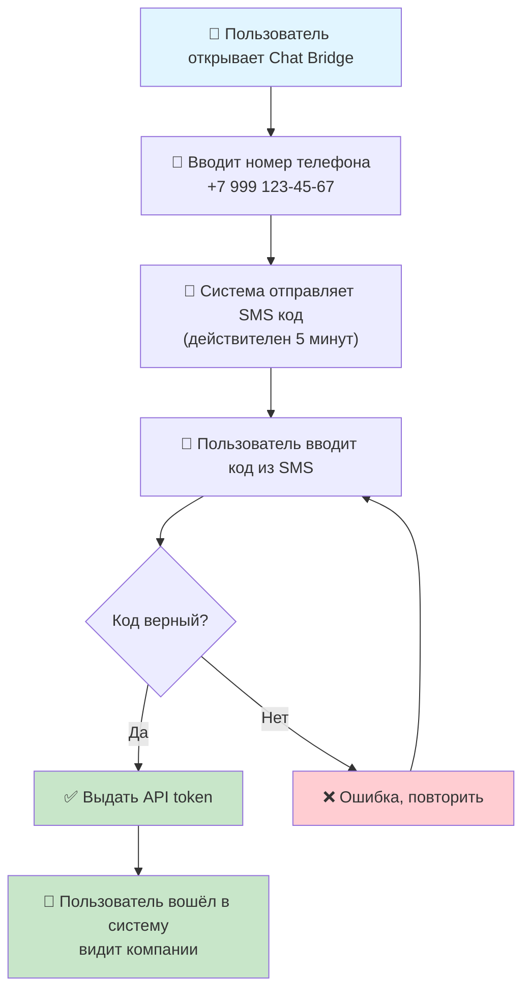
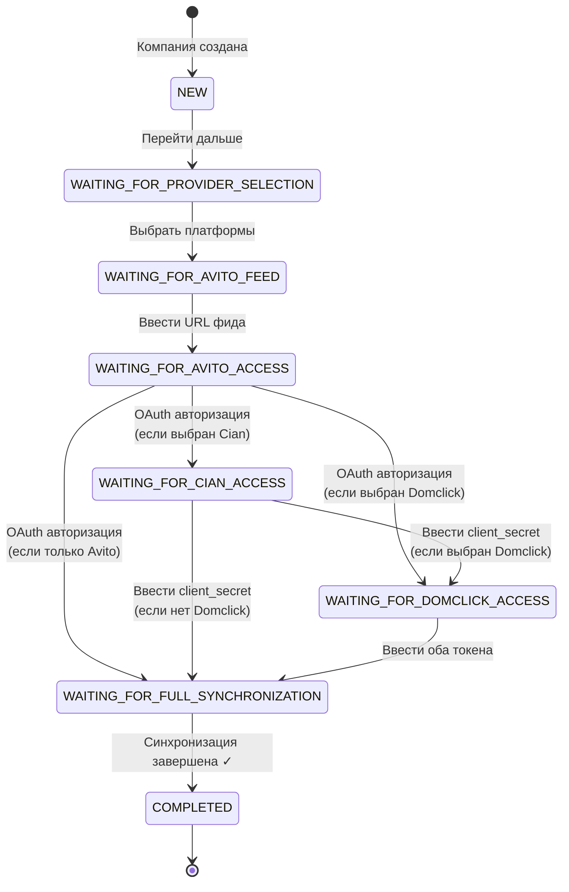
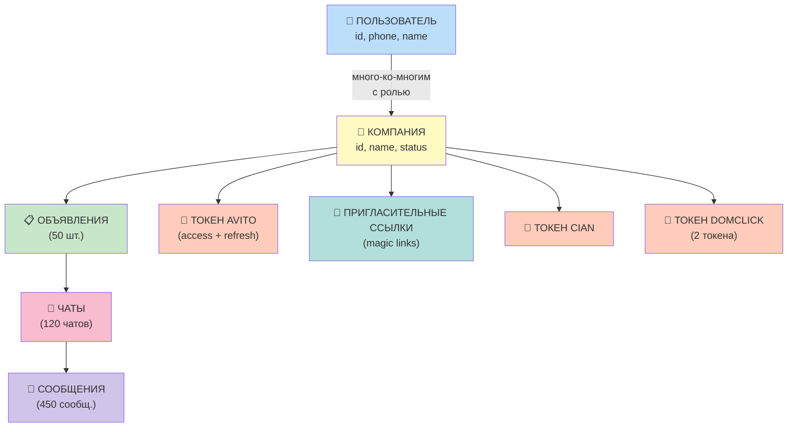
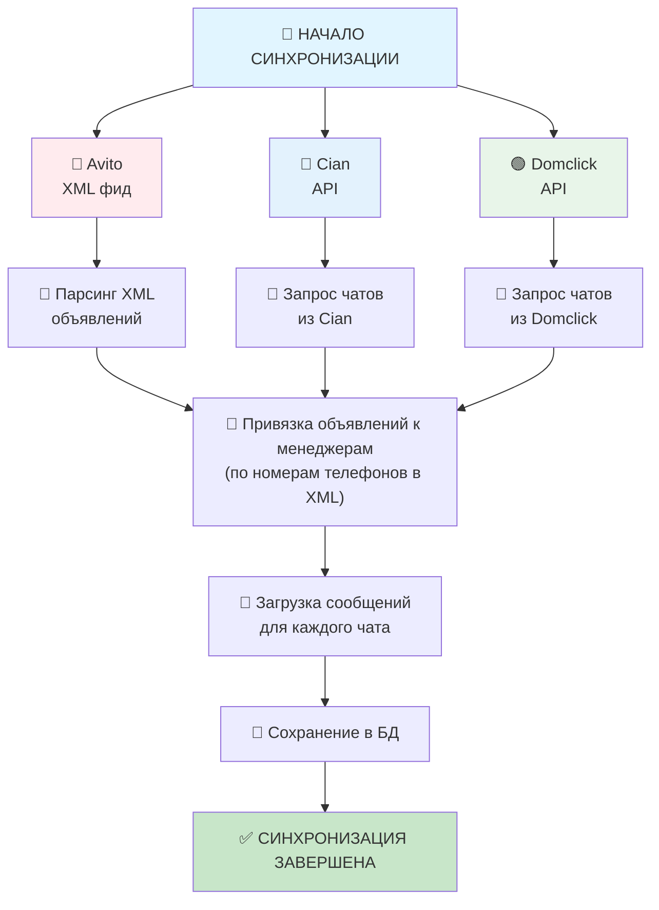
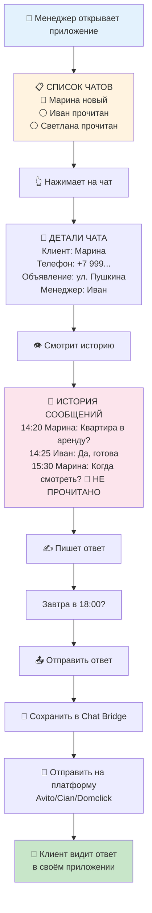
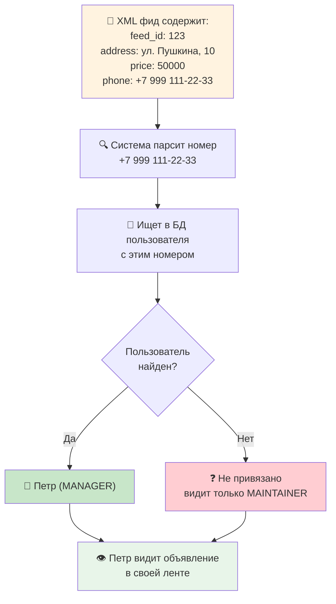
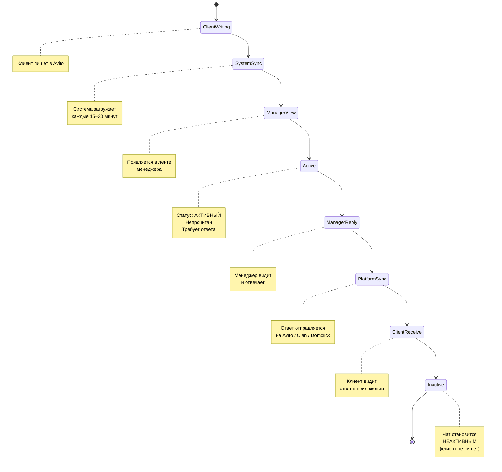
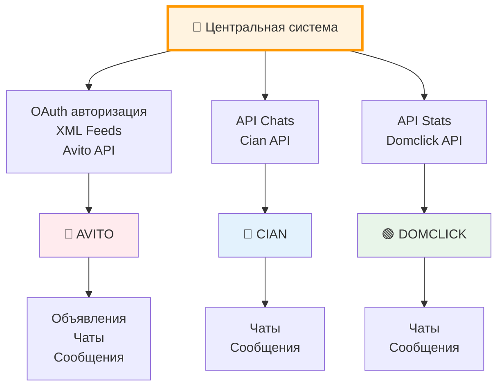
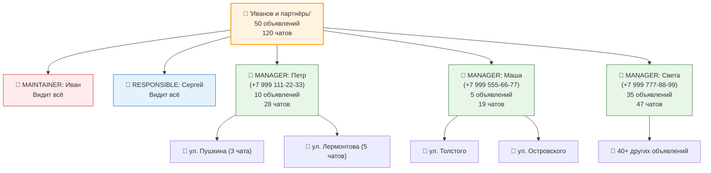

Визуальные представления процессов и связей в системе.

## 1. Процесс регистрации пользователя

## 2. Процесс настройки компании

## 3. Структура данных (граф связей)

## 4. Процесс синхронизации

## 5. Процесс работы с чатом (менеджер)

## 6. Матрица доступа (упрощённо)

| Действие | MAINTAINER | RESPONSIBLE | MANAGER |
|----------|:----------:|:-----------:|:-------:|
| Все компании | ✅ | ✅ | ❌ |
| Все объявления | ✅ | ✅ | ❌ |
| Все чаты | ✅ | ✅ | ❌ |
| Свои объявления | ✅ | ✅ | ✅ |
| Свои чаты | ✅ | ✅ | ✅ |
| Приглашать людей | ✅ | ✅ | ❌ |
| Менять интеграции | ✅ | ❌ | ❌ |
| Удалять компанию | ✅ | ❌ | ❌ |
| Менять роли | ✅ | ❌ | ❌ |

## 7. Как система связывает объявления с менеджерами

## 8. Жизненный цикл чата

## 9. Интеграция с платформами

## 10. Распределение объявлений в компании

