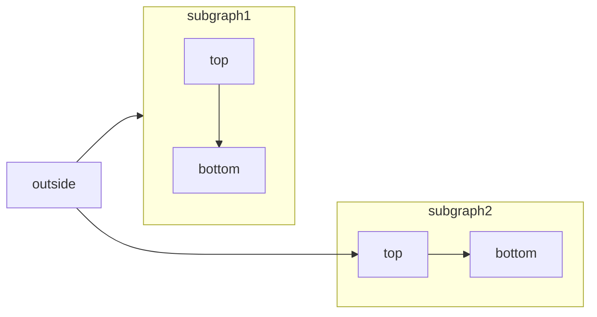

Визуальные представления процессов и связей в системе.



## 1. Процесс регистрации пользователя

```
Менеджер открывает приложение
            │
            ▼
┌─────────────────────────────┐
│   СПИСОК ВСЕХ ЧАТОВ         │
│   (фильтр: только его)      │
│                             │
│   🔴 Марина (новый)         │
│   ⚪ Иван (старый)          │
│   ⚪ Светлана (читан)       │
└──────────────┬──────────────┘
               │
               │ нажимает на чат
               │
               ▼
┌─────────────────────────────┐
│   ДЕТАЛИ ЧАТА               │
│   Клиент: Марина            │
│   Тел: +7 999...            │
│   Объявление: ул. Пуш.      │
│   Менеджер: Иван            │
└──────────────┬──────────────┘
               │
               │ смотрит историю
               │
               ▼
┌─────────────────────────────┐
│   ИСТОРИЯ СООБЩЕНИЙ         │
│                             │
│   14:20 Марина:             │
│   "Квартира в аренду?"      │
│                             │
│   14:25 Иван:               │
│   "Да, готова"              │
│                             │
│   15:30 Марина:             │
│   "Когда смотреть?"         │
│   ◀── НЕ ПРОЧИТАНО          │
│                             │
│   [Написать ответ...]       │
└──────────────┬──────────────┘
               │
               │ пишет ответ
               │
               ▼
         Отправить ответ
               │
               ├─ Сохранить в Lumos
               ├─ Отправить на платформу
               │  (Avito/Cian/Domclick)
               │
               ▼
    Клиент видит ответ в приложении
```

## 2. Процесс настройки компании

```
NEW
            │
            ▼
WAITING_FOR_PROVIDER_SELECTION
            │
            │ Выбрать платформы
            │
            ▼
   WAITING_FOR_AVITO_FEED
            │
            │ Ввести URL фида
            │
            ▼
   WAITING_FOR_AVITO_ACCESS
            │
            │ OAuth авторизация
            │
            ├─────────────────────┬─────────────────────┐
            │                     │                     │
            │                     │                     │
   (если только Avito)    (если + Cian)       (если + Domclick)
            │                     │                     │
            │                     ▼                    │
            │          WAITING_FOR_CIAN_ACCESS          │
            │                     │                     │
            │           Ввести client_secret            │
            │                     │                     │
            │                     ├─────────────────────┤
            │                     │                     │
            │                     │                     ▼
            │                     │        WAITING_FOR_DOMCLICK_ACCESS
            │                     │                     │
            │                     │           Ввести оба токена
            │                     │                     │
            └─────────────────────┴─────────────────────┘
                                  │
                                  ▼
              WAITING_FOR_FULL_SYNCHRONIZATION
                                  │
                        ├─ Загрузка объявлений
                        ├─ Загрузка чатов
                        ├─ Загрузка сообщений
                                  │
                                  ▼
                             COMPLETED ✓
```

## 3. Структура данных (граф связей)

```
┌─────────────────────┐
                    │   ПОЛЬЗОВАТЕЛЬ      │
                    │  id, phone, name    │
                    └──────────┬──────────┘
                               │
                               │ (много-ко-многим)
                               │ с ролью: MAINTAINER/RESPONSIBLE/MANAGER
                               │
                               ▼
                    ┌─────────────────────┐
                    │     КОМПАНИЯ        │
                    │  id, name, status   │
                    └──┬────────┬────────┬┘
                       │        │        │
                       │        │        └───────────────────┐
                       │        │                            │
                       │        ▼                            │
                       │  ┌──────────────────┐               │
                       │  │   ОБЪЯВЛЕНИЯ     │               │
                       │  │    (50 шт.)      │               │
                       │  └────────┬─────────┘               │
                       │           │                         │
                       │           ▼                         │
                       │  ┌──────────────────┐               │
                       │  │      ЧАТЫ        │               │
                       │  │   (120 чатов)    │               │
                       │  └────────┬─────────┘               │
                       │           │                         │
                       │           ▼                         │
                       │  ┌──────────────────┐               │
                       │  │    СООБЩЕНИЯ     │               │
                       │  │   (450 сообщ.)   │               │
                       │  └──────────────────┘               │
                       │                                     │
                       ▼                                     ▼
            ┌──────────────────┐              ┌─────────────────────┐
            │   ТОКЕН AVITO    │              │  ПРИГЛАСИТЕЛЬНЫЕ    │
            │  (access +       │              │      ССЫЛКИ         │
            │   refresh)       │              │   (magic links)     │
            └────────┬─────────┘              └─────────────────────┘
                     │
        ┌────────────┴────────────┐
        │                         │
        ▼                         ▼
┌───────────────┐         ┌───────────────┐
│  CIAN TOKEN   │         │   DOMCLICK    │
│               │         │  (2 ТОКЕНА)   │
└───────────────┘         └───────────────┘
```

## 4. Процесс синхронизации

```
                    НАЧАЛО СИНХРОНИЗАЦИИ
                           │
            ┌──────────────┬┴┬──────────────┐
            │              │ │              │
            ▼              ▼ ▼              ▼
      ┌─────────┐    ┌──────────┐    ┌──────────┐
      │ AVITO   │    │  CIAN    │    │ DOMCLICK │
      │ XML фид │    │  API     │    │   API    │
      └────┬────┘    └────┬─────┘    └────┬─────┘
           │              │              │
           ▼              ▼              ▼
    Парсинг XML      Запрос чатов    Запрос чатов
           │              │              │
           ├──────────────┼──────────────┤
           │ (объединение данных)       │
           ▼                            ▼
    ┌─────────────────────────────────────┐
    │ Привязка объявлений к менеджерам   │
    │ (по номерам телефонов в XML)       │
    └──────────────┬──────────────────────┘
                   │
                   ▼
    ┌─────────────────────────────────────┐
    │ Загрузка сообщений для каждого чата│
    └──────────────┬──────────────────────┘
                   │
                   ▼
    ┌─────────────────────────────────────┐
    │ Сохранение в базу данных           │
    └──────────────┬──────────────────────┘
                   │
                   ▼
            СИНХРОНИЗАЦИЯ ЗАВЕРШЕНА
```

## 5. Процесс работы с чатом (менеджер)

```
Менеджер открывает приложение
            │
            ▼
┌─────────────────────────────┐
│   СПИСОК ВСЕХ ЧАТОВ         │
│   (фильтр: только его)      │
│                             │
│   🔴 Марина (новый)         │
│   ⚪ Иван (старый)          │
│   ⚪ Светлана (читан)       │
└──────────────┬──────────────┘
               │
               │ нажимает на чат
               │
               ▼
┌─────────────────────────────┐
│   ДЕТАЛИ ЧАТА               │
│   Клиент: Марина            │
│   Тел: +7 999...            │
│   Объявление: ул. Пуш.      │
│   Менеджер: Иван            │
└──────────────┬──────────────┘
               │
               │ смотрит историю
               │
               ▼
┌─────────────────────────────┐
│   ИСТОРИЯ СООБЩЕНИЙ         │
│                             │
│   14:20 Марина:             │
│   "Квартира в аренду?"      │
│                             │
│   14:25 Иван:               │
│   "Да, готова"              │
│                             │
│   15:30 Марина:             │
│   "Когда смотреть?"         │
│   ◀── НЕ ПРОЧИТАНО          │
│                             │
│   [Написать ответ...]       │
└──────────────┬──────────────┘
               │
               │ пишет ответ
               │
               ▼
         Отправить ответ
               │
               ├─ Сохранить в Lumos
               ├─ Отправить на платформу
               │  (Avito/Cian/Domclick)
               │
               ▼
    Клиент видит ответ в приложении
```

## 6. Матрица доступа (упрощённо)

```
                 MAINTAINER   RESPONSIBLE   MANAGER
                     │            │           │
Все компании        ✅            ✅           ❌
Все объявления      ✅            ✅           ❌
Все чаты            ✅            ✅           ❌
Свои объявления     ✅            ✅           ✅
Свои чаты           ✅            ✅           ✅
Приглашать людей    ✅            ✅           ❌
Менять интеграции   ✅            ❌           ❌
Удалять компанию    ✅            ❌           ❌
Менять роли         ✅            ❌           ❌
```

## 7. Как система связывает объявления с менеджерами

```
XML фид содержит:
┌───────────────────────────────┐
│ <ad>                          │
│   <feed_id>123</feed_id>      │
│   <address>ул. Пушкина, 10</address>
│   <price>50000</price>        │
│   <phone>+7 999 111-22-33</phone>
│ </ad>                         │
└───────────┬───────────────────┘
            │
            ▼
System парсит: номер +7 999 111-22-33
            │
            ▼
Система ищет в БД пользователя с этим номером
            │
        ┌───┴────┐
        │         │
        ▼ (нашли) ▼ (не нашли)
    ┌─────────┐  ┌─────────────┐
    │ Петр    │  │ (не привязано)
    │ MANAGER │  │ видит только MAINTAINER
    └────┬────┘  └─────────────┘
         │
         ▼
Петр видит объявление в своей ленте
```

## 8. Жизненный цикл чата

```
Клиент пишет в чат на Avito
         │
         ▼
Система загружает чат (в фоне каждые 15-30 мин)
         │
         ▼
Чат появляется в ленте менеджера
         │
         ├─ Статус: АКТИВНЫЙ 🟢
         ├─ Непрочитан
         ├─ Требует ответа
         │
         ▼
Менеджер видит чат и отвечает
         │
         ▼
Ответ отправляется на Avito
         │
         ▼
Клиент видит ответ в приложении Avito
         │
         ├─ (клиент больше не пишет)
         │
         ▼
Чат переходит в статус НЕАКТИВНЫЙ ⚪
```

## 9. Интеграция с платформами

```
┌─────────────────────────────────────────────────────────────┐
│                        LUMOS API                            │
└──────────────┬──────────────────┬──────────────────┬────────┘
               │                  │                  │
        ┌──────▼──────┐    ┌──────▼──────┐   ┌──────▼──────┐
        │              │    │              │   │              │
        ▼              ▼    ▼              ▼   ▼              ▼
    OAuth auth    API Chats API Stats    API Chats
    XML Feeds     Cian API   Domclick    Cian API
   Avito API                  API         Domclick API
        │              │    │              │   │              │
        └──────┬──────┘    └──────┬──────┘   └──────┬────────┘
               │                  │                  │
        ┌──────▼──────┐    ┌──────▼──────┐   ┌──────▼──────┐
        │   AVITO     │    │    CIAN     │   │ DOMCLICK    │
        │             │    │             │   │             │
        │ Объявления  │    │ Чаты        │   │ Чаты        │
        │ Чаты        │    │ Сообщения   │   │ Сообщения   │
        │ Сообщения   │    │             │   │             │
        └─────────────┘    └─────────────┘   └─────────────┘
```

## 10. Распределение объявлений в компании

```
Компания "Иванов и партнёры"
        │
        ├─ MAINTAINER: Иван (видит всё)
        │
        ├─ RESPONSIBLE: Сергей (видит всё)
        │
        ├─ MANAGER: Петр (+7 999 111-22-33)
        │            │ видит: 10 объявлений
        │            │ видит: 28 чатов
        │            │
        │ ┌──────────┴───────────┐
        │ │                      │
        │ ▼                      ▼
        │ Объявление 1    Объявление 2
        │ "ул. Пушкина"   "ул. Лермонтова"
        │ (3 чата)        (5 чатов)
        │
        │
        ├─ MANAGER: Маша (+7 999 555-66-77)
        │            │ видит: 5 объявлений
        │            │ видит: 19 чатов
        │            │
        │ ┌──────────┴───────┐
        │ │                  │
        │ ▼                  ▼
        │ Объявление 3    Объявление 4
        │ "ул. Толстого"  "ул. Островского"
        │
        └─ MANAGER: Света (+7 999 777-88-99)
                    │ видит: 35 объявлений
                    │ видит: 47 чатов
```