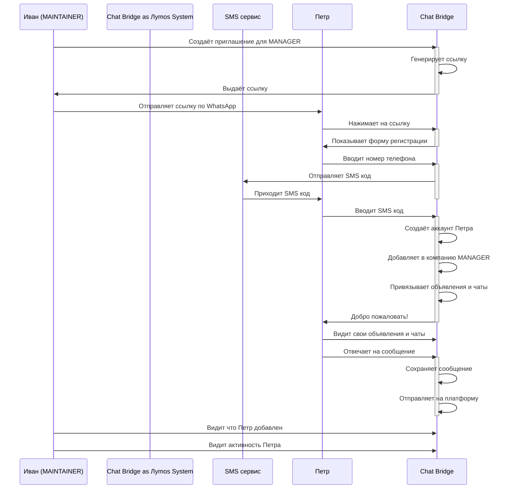
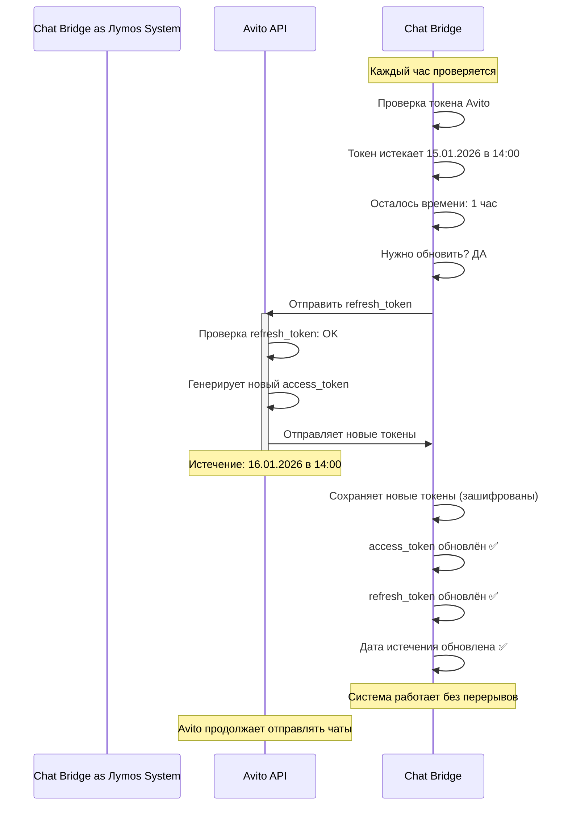
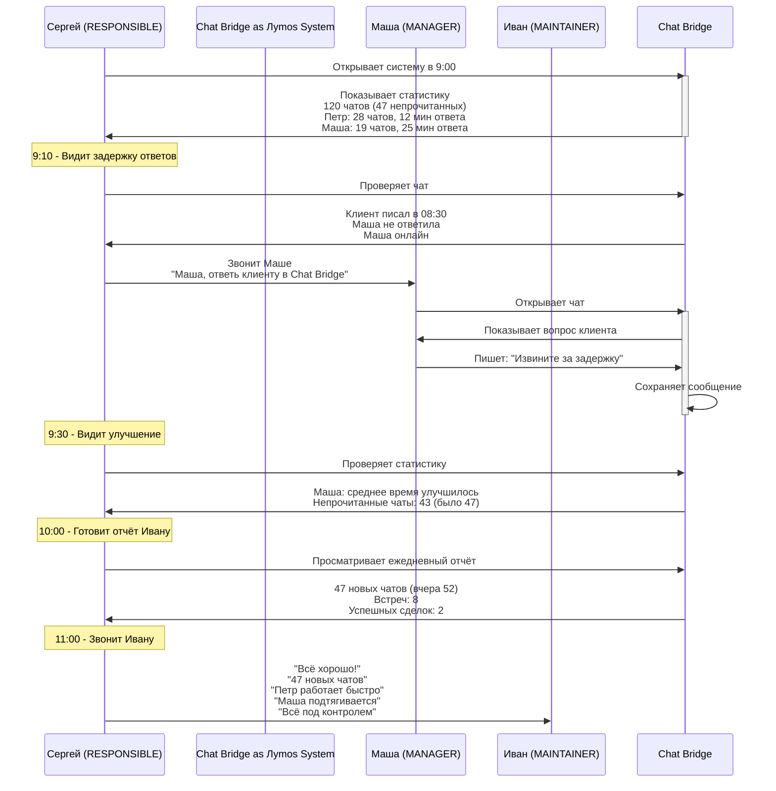

Реальные сценарии работы с системой Chat Bridge.

## Сценарий 1: Новое агентство регистрируется в системе

### Персонажи
- **Иван Иванов** — владелец нового агентства "Иванов и партнёры"
- **Приложение** — Chat Bridge
- **Платформы** — Avito, Cian, Domclick

### Начальная ситуация
Иван работает риэлтором 5 лет. У него есть объявления на Avito, Cian и Domclick. Клиенты пишут в чаты в каждой платформе. Иван хочет видеть всё в одном месте.

### Шаг за шагом

```mermaid
timeline
    title Сценарий 1: Регистрация компании (День 1)
    10:00 : Иван открывает Chat Bridge
          : Регистрируется (+7 999 123-45-67)
          : Получает SMS код: 7382
          : Верифицирует номер
          : Аккаунт создан
    10:05 : Создаёт компанию "Иванов и партнёры"
          : Вводит название и реквизиты
          : Компания создана
    10:10 : Выбирает платформы
          : ✅ Avito (обязательно)
          : ✅ Cian
          : ✅ Domclick
    10:15 : Вводит URL XML фида Avito
          : URL: https://mysite.com/feeds/avito.xml
          : Система проверяет: OK
    10:20 : Авторизуется в Avito через OAuth
          : Вводит логин/пароль
          : Разрешает доступ
          : Avito отправляет токены
    10:25 : Вводит API токен для Cian
          : Логинится на cian.ru
          : Копирует client_secret
          : Система проверяет: OK
    10:30 : Вводит токены для Domclick
          : Company ID: 12345
          : Stats Secret: abc123xyz
          : Chats Secret: def789uvw
          : Система проверяет: OK
    10:35-11:00 : Синхронизация данных
               : Загружены 50 объявлений
               : Загружены 120 чатов
               : Загружены 450 сообщений
               : Статус: COMPLETED ✓
    11:05 : Иван видит ленту чатов
          : 🔴 Марина: "Квартира свободна?" (новый)
          : 🔴 Иван К.: "Когда посмотреть?" (новый)
          : ⚪ Светлана: "Спасибо" (прочитан)
          : Иван пишет ответ Марине
    11:10 : Система отправляет ответ на Avito
          : Марина видит ответ в приложении Avito
    11:15 : Иван доволен
          : Все чаты в одном месте
          : Не нужно переключаться между приложениями
          : Нажимает "Пригласить менеджера"
```

### Результат
✅ Компания создана и полностью настроена
✅ Все объявления синхронизированы
✅ Все чаты видны в одном месте
✅ Иван может начать работать с клиентами более эффективно

---

## Сценарий 2: Добавление нового менеджера в команду

### Персонажи
- **Иван** — владелец (MAINTAINER)
- **Петр** — новый менеджер (будет MANAGER)
- **Компания** — "Иванов и партнёры" (уже готова)

### Начальная ситуация
Компания растёт. Иван нанял нового менеджера Петра. Петр работает с квартирами на ул. Пушкина (3 объявления). Нужно добавить Петра в систему и показать ему его объявления и чаты.

### Шаг за шагом



### Результат
✅ Петр успешно добавлен в компанию
✅ Петр видит только свои 3 объявления и свои 15 чатов
✅ Петр может отвечать на сообщения
✅ Иван видит, что Петр работает
✅ Ссылка больше не работает (лимит 1 использование исчерпан)

---

## Сценарий 3: Подключение новой платформы

### Персонажи
- **Иван** — владелец компании
- **Компания** — работает с Avito и Cian, хочет добавить Domclick

### Начальная ситуация
Компания уже месяц работает с Avito и Cian. Подписались на Domclick и хотят добавить третью платформу, не останавливая работу.

### Шаг за шагом

```mermaid
timeline
    title Сценарий 3: Подключение новой платформы (Domclick)
    Пн, 14:00 : Иван открывает настройки интеграций
              : Видит Avito ✅ и Cian ✅
              : Domclick ❌ не подключен
              : Нажимает "Подключить Domclick"
    Пн, 14:05 : Иван логинится на domclick.ru
              : Копирует Company ID: 12345
              : Генерирует stats_secret
              : Генерирует chats_secret
              : Возвращается в Chat Bridge
    Пн, 14:10 : Вводит токены в Chat Bridge
              : Company ID: 12345
              : Stats Secret: stats_a1b2c3d4e5f6
              : Chats Secret: chats_x9y8z7w6v5u4
              : Нажимает "Проверить"
    Пн, 14:11 : Система проверяет токены
              : Stats Secret: ✅ OK
              : Chats Secret: ✅ OK
              : Токены сохранены (зашифрованы)
    Пн, 14:12-14:30 : Синхронизация Domclick
                    : Загружены 60 чатов
                    : Загружены 200 сообщений
                    : Чаты привязаны к объявлениям
    Пн, 14:30 : Синхронизация завершена
              : Domclick подключен ✅
              : 60 новых чатов добавлены
              : Система синхронизирует 3 платформы
    Вт, 09:00 : Петр видит новые чаты
              : Было 15 чатов (Avito + Cian)
              : Появилось 5 чатов из Domclick
              : Всего 20 чатов
    Вт, 09:05 : Петр может:
              : Видеть все чаты в одной ленте
              : Фильтровать по платформе
              : Отвечать в любом чате
              : Ответы синхронизируются автоматически
```

### Результат
✅ Domclick успешно подключен без остановки работы
✅ Добавилось 60 новых чатов
✅ Все платформы синхронизируются автоматически
✅ Менеджеры видят все чаты в одной ленте
✅ Система работает как раньше, но ещё лучше

---

## Сценарий 4: Менеджер обрабатывает чаты в рабочий день

### Персонажи
- **Петр** — менеджер (MANAGER)
- **Клиенты** — Марина, Иван, Светлана

### Рабочий день Петра

```mermaid
timeline
    title Сценарий 4: Рабочий день менеджера Петра
    09:00 : Петр открывает Chat Bridge
          : Видит ленту чатов
          : 8 новых чатов (пришли ночью)
    09:05 : Петр видит непрочитанные:
          : 🔴 Марина: "Можно ещё раз посмотреть?" (новый)
          : 🔴 Иван: "В какой день лучше?" (новый)
          : 🔴 Светлана: "Когда рассчитаремся?" (новый)
          : ... ещё 5 новых чатов
    09:10 : Петр открывает чат Марины
          : Видит полную историю переписки (3 дня)
          : Пишет: "Конечно! Завтра в 19:00?"
          : Отправляет ответ
    09:15 : Переходит к чату Ивана
          : Видит вопрос: "В какой день лучше?"
          : Пишет: "На выходных? В субботу в 11:00?"
          : Отправляет
    09:45 : Петр уходит на показ квартир
          : Система синхронизирует новые чаты
          : Система загружает новые сообщения
    12:00 : Петр видит 3 новых ответа:
          : 🔴 Марина: "Спасибо! Буду в 19:00"
          : 🔴 Иван: "Суббота подходит!"
          : 🔴 Светлана: "Когда смотреть будем?"
          : Петр отвечает Светлане: "Завтра в 14:00?"
    14:00 : Петр назначил 2 встречи:
          : Марина: завтра в 19:00
          : Иван: суббота в 11:00
    17:00 : Конец рабочего дня
          : Статистика:
          : ✓ Обработано чатов: 8
          : ✓ Встреч назначено: 2
          : ✓ Среднее время ответа: 15 минут
          : ✓ Все вопросы закрыты
```

### Результат
✅ Петр эффективно обработал 8 чатов
✅ Назначил 2 встречи с клиентами
✅ Работал из одной системы вместо 3-х приложений
✅ Не потерял ни один чат

---

## Сценарий 5: Обновление токена Avito (автоматическое)

### Фоновый процесс (пользователь этого не видит)



**Результат:**
✅ Токен автоматически обновлен
✅ Avito продолжает отправлять чаты
✅ Пользователь ничего не заметил

---

## Сценарий 6: RESPONSIBLE контролирует работу менеджеров

### Персонажи
- **Иван** — MAINTAINER (владелец)
- **Сергей** — RESPONSIBLE (супервайзер)
- **Петр, Маша** — MANAGER (менеджеры)

### Утро рабочего дня



### Результат
✅ Сергей контролирует 2 менеджеров из одной системы
✅ Видит статистику и аналитику
✅ Может быстро вмешаться, если есть проблемы
✅ Управление командой стало эффективнее
