Этот документ описывает все основные процессы в системе: как пользователи регистрируются, как создают компанию, как работают с интеграциями и чатами.

## 1. Регистрация и аутентификация пользователя

### 1.1 Общий процесс

Каждый новый пользователь должен зарегистрироваться в системе. Регистрация двухэтапная: сначала по номеру телефона, затем верификация по SMS коду.

### 1.2 Пошаговый процесс

**Шаг 1: Пользователь вводит номер телефона**
- Пользователь открывает приложение/сайт Chat Bridge
- Вводит свой номер телефона (например: +7 999 123-45-67)
- Система нормализует номер (приводит к единому формату: +79991234567)

**Шаг 2: Система отправляет SMS код**
- Система генерирует случайный 4-значный код (например: 1234)
- Система отправляет SMS: "Ваш код для входа в Chat Bridge: 1234"
- Код действителен 5 минут

**Шаг 3: Пользователь вводит код из SMS**
- Пользователь получает SMS и вводит код в приложение
- Если код неверный — ошибка, нужно попросить новый код
- Если прошло > 5 минут — код истёк, нужно запросить новый

**Шаг 4: Система проверяет код и создаёт/находит пользователя**
- Если это **первая регистрация** — система создаёт нового пользователя
- Если это **повторный вход** — система находит существующего пользователя
- Система отмечает пользователя как "верифицированного"

**Шаг 5: Пользователь получает доступ к системе**
- Система выдаёт пользователю уникальный **API токен** (длинная строка вроде `a1b2c3d4e5f6g7h8...`)
- Этот токен нужен для всех последующих запросов к системе
- Пользователь может теперь видеть свои компании и данные

### 1.3 Специальный случай: Регистрация по пригласительной ссылке

Если пользователь регистрируется, **переходя по пригласительной ссылке**, процесс немного отличается:

**Без пригласительной ссылки:**
1. Вход → SMS верификация → Пользователь видит пустой список компаний → Может создать свою компанию

**С пригласительной ссылкой:**
1. Пользователь нажимает на ссылку → Вход → SMS верификация → **Автоматическое присоединение к компании** → Может сразу видеть данные компании

**Что происходит при регистрации по ссылке:**
- Пользователь автоматически добавляется в компанию с определённой ролью (MAINTAINER, RESPONSIBLE или MANAGER)
- Все объявления компании **автоматически привязываются к пользователю** (по номеру телефона)
- Счётчик использований ссылки увеличивается на 1
- Если ссылка имела лимит использований, и он исчерпан, других пользователей больше не смогут присоединиться

### 1.4 Например: Процесс присоединения нового менеджера

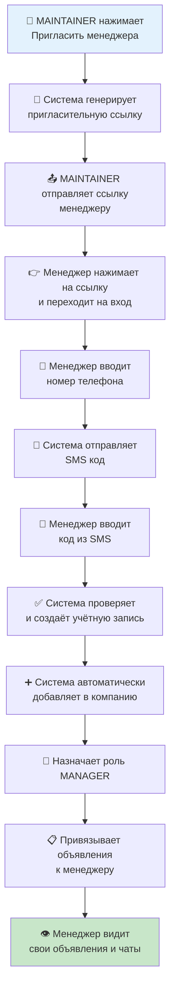

## 2. Жизненный цикл компании

### 2.1 Общее описание

Компания в системе проходит несколько этапов, от создания до полной работы. На каждом этапе система требует выполнения определённых действий.

### 2.2 Пять основных этапов

#### Этап 1: СОЗДАНИЕ (NEW)

**Что происходит:**
- Пользователь (MAINTAINER) создаёт новую компанию
- Вводит название компании (обязательно)
- Опционально вводит юридические реквизиты (ИНН, ОГРН, банковские реквизиты и т.д.)

**Система делает:**
- Создаёт запись о компании в базе данных
- Автоматически присваивает статус **WAITING_FOR_PROVIDER_SELECTION**
- Добавляет создателя в компанию с ролью MAINTAINER

**Пример:**
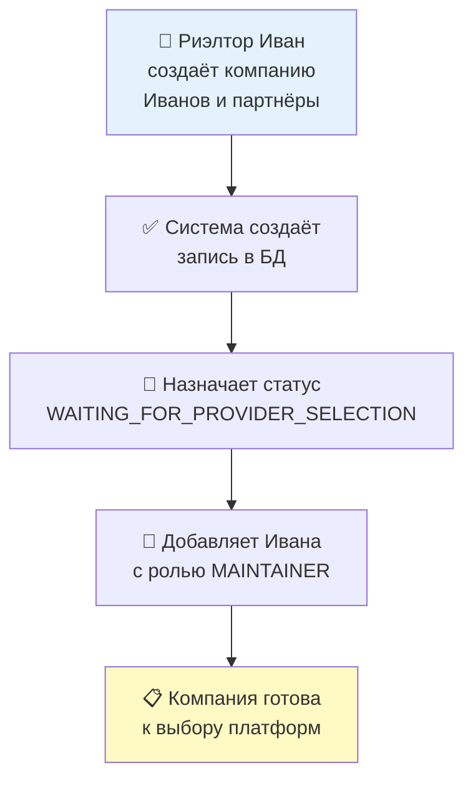

#### Этап 2: ВЫБОР ПЛАТФОРМ (WAITING_FOR_PROVIDER_SELECTION)

**Что происходит:**
- Пользователь выбирает, какие платформы хочет подключить
- Avito — **ОБЯЗАТЕЛЬНО**
- Cian — опционально (флаг `use_cian = true/false`)
- Domclick — опционально (флаг `use_domclick = true/false`)

**Система делает:**
- Сохраняет выбор пользователя
- Если выбран Avito → переходит в статус **WAITING_FOR_AVITO_FEED**
- Если выбран Cian → позже перейдёт в статус **WAITING_FOR_CIAN_ACCESS**
- Если выбран Domclick → позже перейдёт в статус **WAITING_FOR_DOMCLICK_ACCESS**

**Пример:**
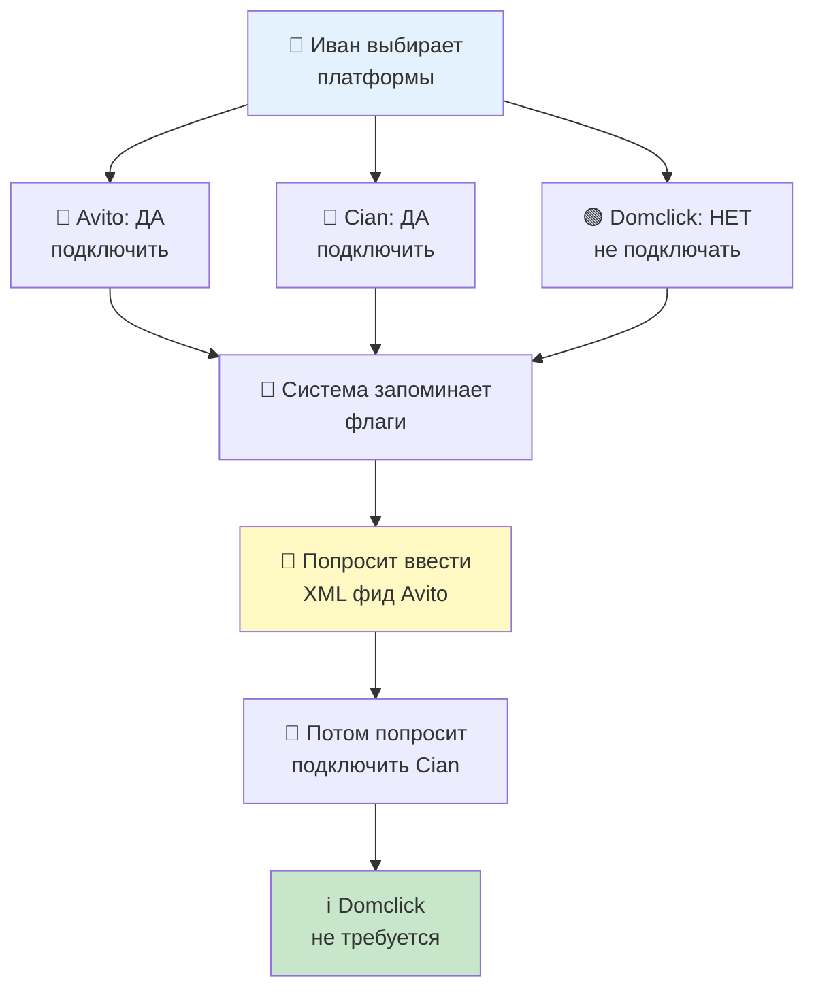

#### Этап 3: НАСТРОЙКА AVITO (WAITING_FOR_AVITO_FEED → WAITING_FOR_AVITO_ACCESS)

**Шаг 3.1: Ввод XML фида**

**Что происходит:**
- Пользователь вводит URL XML фида со своими объявлениями
- URL примерно такой: `https://example.com/my_real_estate_feed.xml`

**Система делает:**
- Сохраняет URL
- Пока ничего не загружает (загрузит позже)
- Переходит в статус **WAITING_FOR_AVITO_ACCESS**

**Шаг 3.2: OAuth авторизация в Avito**

**Что происходит:**
- Пользователь нажимает "Подключить Avito"
- Переводится на сайт Avito (как авторизация в соцсети)
- Вводит логин и пароль от своего аккаунта на Avito
- Avito спрашивает: "Разрешить Chat Bridge доступ к вашему аккаунту?"
- Пользователь нажимает "Разрешить"

**Система делает:**
- Получает от Avito специальный **код авторизации**
- Обменивает этот код на **access_token** и **refresh_token**
- Сохраняет токены в зашифрованном виде
- Переходит в следующий статус

**Если выбраны другие платформы:**
- Переходит в **WAITING_FOR_CIAN_ACCESS** или **WAITING_FOR_DOMCLICK_ACCESS**
- Если других платформ нет → переходит в **WAITING_FOR_FULL_SYNCHRONIZATION**

**Пример:**
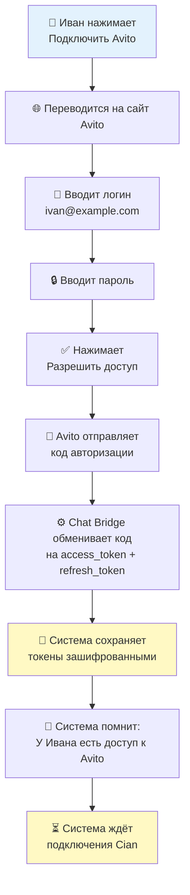

#### Этап 4: НАСТРОЙКА ДРУГИХ ПЛАТФОРМ (если выбраны)

**Для Cian:**
1. Пользователь берёт `client_secret` из личного кабинета Cian
2. Вводит его в Chat Bridge
3. Система проверяет, работает ли токен (делает запрос в Cian API)
4. Если работает → сохраняет токен
5. Если не работает → ошибка, нужно проверить токен

**Для Domclick:**
1. Пользователь берёт два токена из личного кабинета: `stats_secret` и `chats_secret`
2. Вводит ID своей компании в системе Domclick
3. Вводит оба токена в Chat Bridge
4. Система проверяет оба токена отдельно
5. Если оба работают → сохраняет
6. Если один не работает → ошибка

#### Этап 5: ПОЛНАЯ СИНХРОНИЗАЦИЯ (WAITING_FOR_FULL_SYNCHRONIZATION)

**Что происходит:**
- Система запускает автоматическую синхронизацию всех данных
- Это может занять от нескольких минут до часа (зависит от объёма)

**Система делает:**

1. **Загрузка объявлений из Avito:**
   - Скачивает XML фид по URL
   - Парсит объявления (адрес, цена, описание, фото)
   - Получает публичные ID объявлений через Avito API
   - Загружает объявления в базу данных

2. **Привязка объявлений к менеджерам:**
   - Для каждого объявления есть номер телефона менеджера
   - Система ищет в системе пользователя с таким номером телефона
   - Если находит → привязывает объявление к этому пользователю
   - Если не находит → объявление остаётся "свободным" (только владелец может видеть)

3. **Загрузка чатов со всех платформ:**
   - Для каждой подключённой платформы (Avito, Cian, Domclick)
   - Система запрашивает все активные чаты
   - Сохраняет чаты в базу данных

4. **Загрузка сообщений:**
   - Для каждого чата система загружает всю историю сообщений
   - Сохраняет дату, время, текст, автора, статус доставки

5. **Завершение:**
   - Если всё прошло успешно → статус меняется на **COMPLETED**
   - Если была ошибка → статус остаётся **WAITING_FOR_FULL_SYNCHRONIZATION**
   - Пользователь может попросить пересин хронизацию вручную

**Пример синхронизации:**
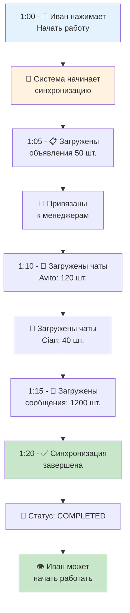

### 2.3 Состояние COMPLETED и дальнейшая работа

**После завершения настройки:**
- Статус компании = **COMPLETED**
- Система работает в **автоматическом режиме**
- Фоновые процессы регулярно:
  - Обновляют токены Avito (раз в час)
  - Загружают новые чаты (каждые 15-30 минут)
  - Загружают новые сообщения (каждые 15-30 минут)

**Что может сделать пользователь:**
- Добавить в компанию новых менеджеров
- Выключить платформу (например, перестать использовать Cian)
- Обновить токены вручную при ошибках
- Запросить полную повторную синхронизацию

## 3. Управление командой

### 3.1 Роли в компании

Каждый пользователь в компании имеет одну из трёх ролей:

#### MAINTAINER (Владелец/Администратор)

**Права:**
- Создавать и удалять компанию
- Изменять все данные компании (название, реквизиты)
- Создавать пригласительные ссылки для добавления других пользователей
- Управлять интеграциями (подключать/отключать платформы, обновлять токены)
- Видеть всех пользователей в компании и их роли
- Удалять пользователей из компании

**Количество:**
- В каждой компании может быть несколько MAINTAINER

**Пример:**
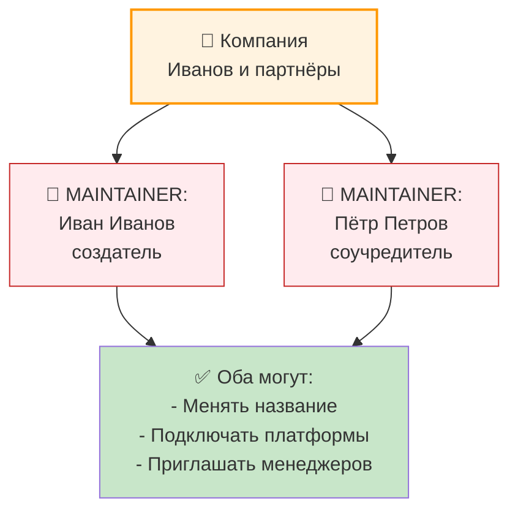

#### RESPONSIBLE (Ответственный)

**Права:**
- Видеть все объявления и чаты компании
- Видеть данные всех менеджеров
- Создавать пригласительные ссылки
- **НЕ может:** управлять интеграциями, менять данные компании, удалять компанию

**Количество:**
- Может быть несколько в компании

**Пример:**
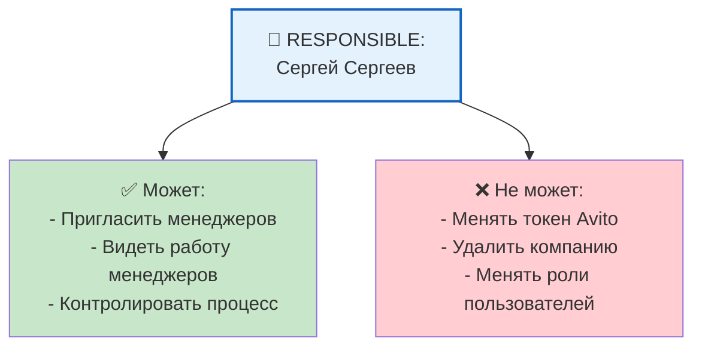

#### MANAGER (Менеджер)

**Права:**
- Видеть объявления, которые к нему привязаны
- Видеть чаты по этим объявлениям
- Отвечать в чатах
- Видеть свой профиль

**Ограничения:**
- **НЕ может видеть:** объявления других менеджеров, чаты других менеджеров, данные компании, настройки платформ
- **Видит только свои объявления и чаты**

**Пример:**
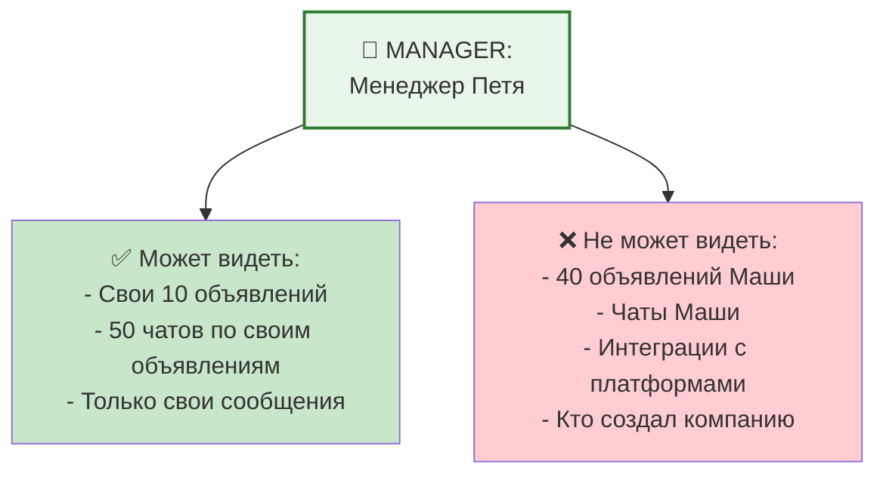

### 3.2 Процесс добавления нового пользователя

**Шаг 1: MAINTAINER или RESPONSIBLE создаёт пригласительную ссылку**

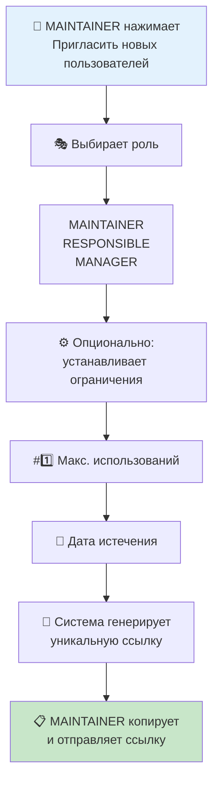

**Шаг 2: Новый пользователь переходит по ссылке и регистрируется**

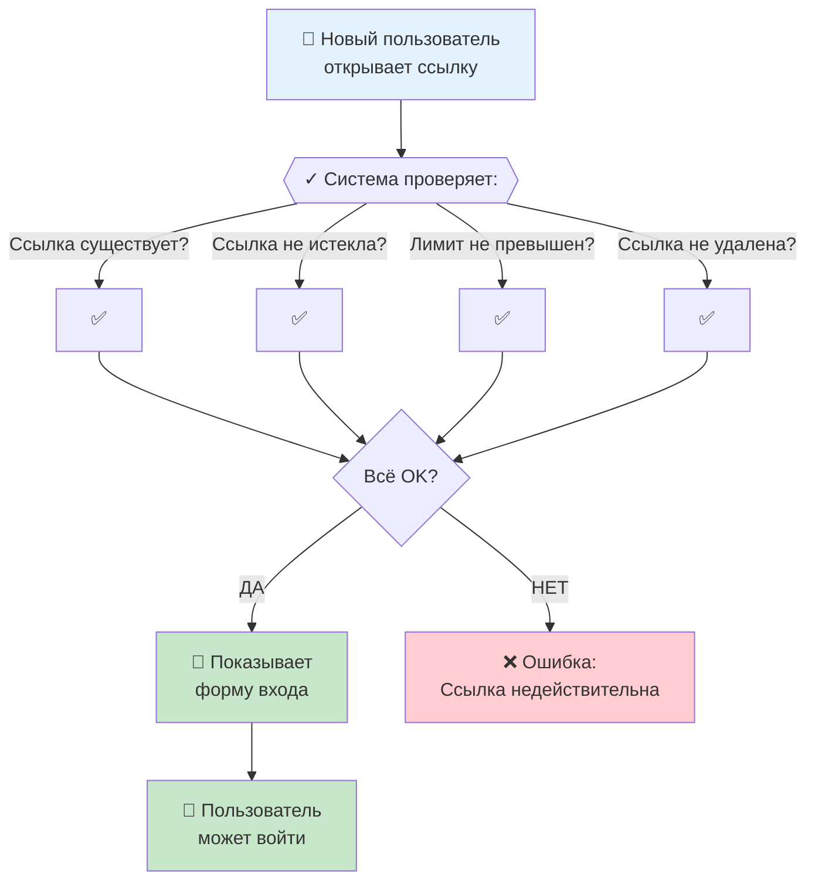

**Шаг 3: Система автоматически присоединяет пользователя**

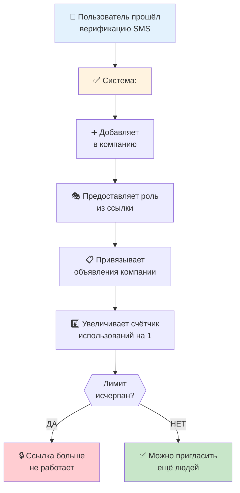

### 3.3 Отзыв пригласительной ссылки

**Когда может быть нужно:**
- Ссылка была случайно отправлена не тому человеку
- Хотите изменить срок действия ссылки
- Хотите уменьшить лимит использований

**Что происходит:**
- MAINTAINER / RESPONSIBLE удаляет ссылку
- Ссылка больше **не работает**
- Люди, которые уже присоединились по ссылке, остаются в компании
- Новые люди не смогут присоединиться по этой ссылке

## 4. Синхронизация данных

### 4.1 Общие принципы

**Синхронизация** = загрузка и обновление данных из внешних платформ в систему Chat Bridge.

**Почему нужна:**
- Каждый день добавляются новые чаты
- Клиенты пишут новые сообщения
- На платформах могут добавляться новые объявления

**Как часто:**
- **Объявления:** один раз при первой настройке, потом по требованию
- **Чаты и сообщения:** каждые 15-30 минут в автоматическом режиме

### 4.2 Синхронизация объявлений

**Источник данных:** XML фид Avito

**Процесс:**
1. Система скачивает XML по URL
2. Парсит каждое объявление:
   - Адрес, описание
   - Цена, площадь, количество комнат
   - Фото
   - Номер телефона менеджера (в описании или отдельно)
3. Получает публичный ID объявления через Avito API
4. Сохраняет в базу данных

**Привязка к менеджерам:**
- Для каждого объявления в XML есть номер телефона менеджера
- Система ищет пользователя с этим номером в компании
- Если находит → привязывает объявление
- Если не находит → объявление остаётся "свободным"

**Пример:**
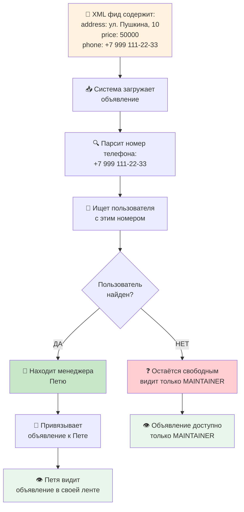

### 4.3 Синхронизация чатов и сообщений

**Процесс:**

**Для каждой подключённой платформы (Avito, Cian, Domclick):**

1. **Запрос чатов:**
   - Система запрашивает у платформы: "Дай мне все активные чаты"
   - Получает список чатов с ID клиента, названием объявления, датой последнего сообщения

2. **Для каждого чата:**
   - Система запрашивает всю историю сообщений
   - Загружает 100+ сообщений (в зависимости от платформы)
   - Сохраняет текст, дату, автора, статус доставки

3. **Привязка к объявлению:**
   - Система видит, какое объявление обсуждается в чате
   - Ищет это объявление в базе данных
   - Привязывает чат к объявлению

4. **Привязка к клиенту:**
   - Система видит, кто написал в чат
   - Ищет пользователя с этим номером телефона
   - Если находит → привязывает чат к пользователю (как "клиент")
   - Если не находит → чат остаётся без привязки (но видна информация о клиенте)

**Пример:**
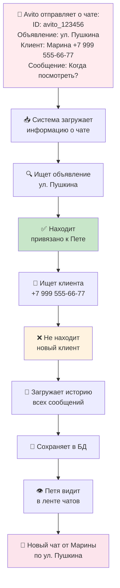

### 4.4 Обновление токенов Avito

**Когда нужно:**
- Все токены имеют срок действия (обычно 1 год или больше)
- За час до истечения система должна обновить токен

**Процесс:**
1. Система проверяет: когда истекает текущий токен?
2. Если осталось < 1 часа → система автоматически обновляет токен
3. Для обновления используется **refresh_token** (специальный токен для обновления)
4. Получает новый **access_token** и новую дату истечения
5. Сохраняет новый токен в БД (в зашифрованном виде)

**Если обновление не удалось:**
- Токен помечается как недоступный (`is_available = false`)
- Система не может загружать чаты из Avito
- MAINTAINER получает уведомление, что нужно переавторизоваться

**Пример:**
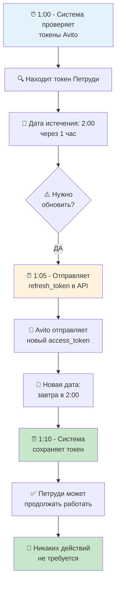

## 5. Работа с чатами

### 5.1 Как видит менеджер

Когда менеджер открывает приложение, он видит **единую ленту всех чатов** со всех платформ, в которых он упомянут:

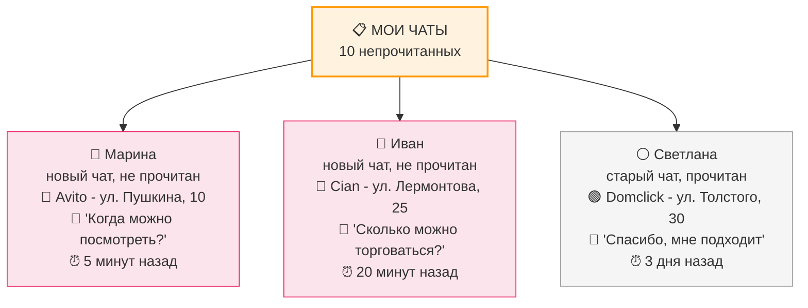

### 5.2 Фильтрация чатов

Менеджер может фильтровать ленту по разным параметрам:

**По статусу прочтения:**
- Только непрочитанные чаты
- Только прочитанные чаты
- Все чаты

**По платформе:**
- Только чаты из Avito
- Только чаты из Cian
- Только чаты из Domclick
- Любая комбинация

**По направлению сообщений:**
- Только входящие (клиент написал)
- Только исходящие (менеджер писал)
- Оба

**По статусу чата:**
- Только активные чаты
- Только архивные чаты

**Поиск:**
- По имени клиента
- По тексту сообщения
- По адресу объявления

**Пример:**
```
Менеджер выбирает фильтры:
- Платформа: только Avito
- Статус: только непрочитанные
- Направление: только входящие

Результат: показывает только те чаты из Avito,
где клиент написал и менеджер ещё не прочитал

Это удобно для быстрой работы с новыми запросами
```

### 5.3 Просмотр чата и истории

**Когда менеджер нажимает на чат:**

1. **Система показывает:**
   - Имя клиента
   - Номер телефона клиента
   - Название объявления и фото
   - Адрес объекта
   - Цена объекта
   - Полная история сообщений в чате

2. **История сообщений:**
   - Все сообщения отсортированы от старых к новым
   - Видно, кто написал (менеджер или клиент)
   - Видна дата и время каждого сообщения
   - Видно, прочитано ли сообщение

3. **Различные типы сообщений:**
   - Текстовые сообщения
   - Фотографии
   - Ссылки
   - Документы/файлы
   - Системные сообщения (например, "Клиент начал набирать...")

### 5.4 Отправка ответа

**Когда менеджер хочет ответить:**

1. **В Chat Bridge:**
   - Менеджер вводит текст ответа
   - Нажимает "Отправить"
   - Система сохраняет сообщение в БД

2. **Синхронизация обратно:**
   - Система отправляет ответ на оригинальную платформу (Avito/Cian/Domclick)
   - Система говорит платформе: "Отправь этот текст клиенту"
   - Платформа доставляет сообщение клиенту

3. **Клиент видит:**
   - Если Avito: ответ появляется в чате Avito
   - Если Cian: ответ появляется в чате Cian
   - Если Domclick: ответ появляется в чате Domclick

**Пример:**
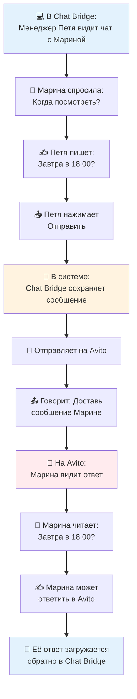

## 6. Статусы и переходы

### 6.1 Статус компании

Компания всегда находится в одном из **9 статусов**:

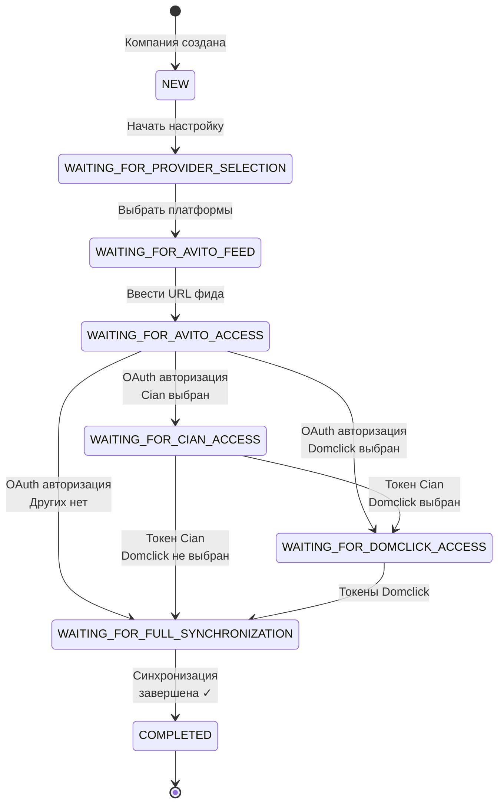

**Важно:** каждый статус требует от пользователя выполнить определённое действие.

### 6.2 Статус сообщения

Каждое сообщение имеет свой статус:

- **НЕОТПРАВЛЕННОЕ** — пользователь ещё печатает или только что нажал отправить
- **ОТПРАВЛЕННОЕ** — система отправила сообщение на платформу
- **ДОСТАВЛЕННОЕ** — платформа подтвердила доставку сообщения клиенту
- **ПРОЧИТАННОЕ** — клиент прочитал сообщение

**Не все платформы поддерживают все статусы** — некоторые платформы не отправляют информацию о прочтении.

### 6.3 Статус чата

- **АКТИВНЫЙ** — есть новые сообщения, идёт активная переписка
- **НЕАКТИВНЫЙ** — давно нет сообщений (если не было сообщений > 7 дней)
- **АРХИВНЫЙ** — чат закрыт, но история сохранена

## 7. Безопасность и конфиденциальность данных

### 7.1 Кто видит что

**MAINTAINER:**
- Видит ВСЕ данные компании
- Видит все объявления
- Видит все чаты
- Видит данные всех пользователей

**RESPONSIBLE:**
- Видит все объявления компании
- Видит все чаты
- Видит данные всех пользователей
- Не видит настройки интеграций (токены)

**MANAGER:**
- Видит ТОЛЬКО свои объявления
- Видит ТОЛЬКО свои чаты
- Видит ТОЛЬКО свои сообщения
- Не видит ничего другого

### 7.2 Защита токенов

- Все токены (Avito, Cian, Domclick) **зашифрованы** в базе данных
- Даже администраторы системы не могут увидеть реальный токен
- Токены используются только для запросов к платформам
- Токены никогда не отправляются клиенту

### 7.3 SMS верификация

- Каждый новый пользователь должен подтвердить номер телефона
- SMS код действителен только 5 минут
- SMS код на 4 цифры (10 000 комбинаций) — невозможно угадать
- Если человек вводит неправильный код 3 раза → нужно запросить новый код
