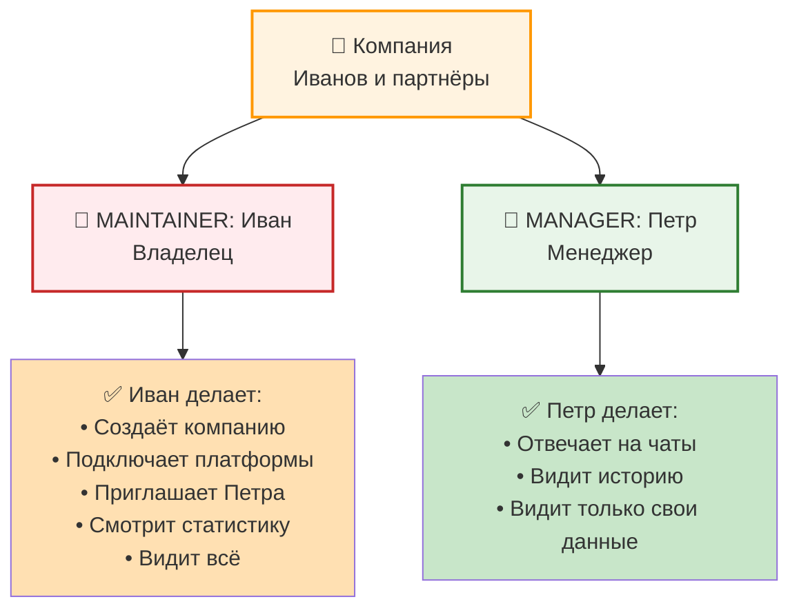
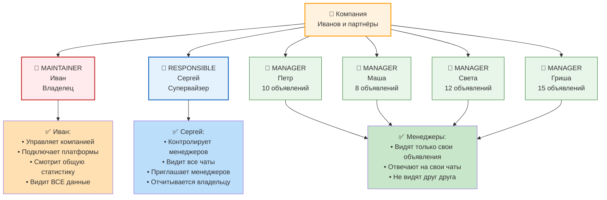
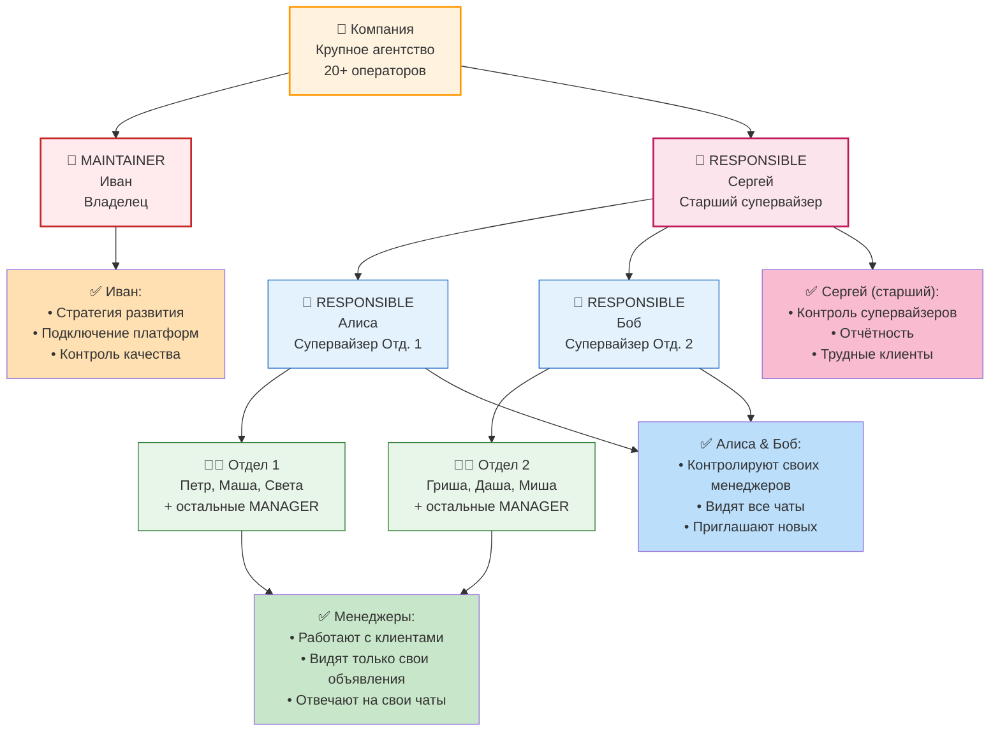

Этот документ объясняет систему ролей в компании и матрицу прав доступа.

## Три основные роли

### MAINTAINER (Владелец/Администратор)

**Кто это:**
- Создатель компании (автоматически получает эту роль)
- Может быть несколько MAINTAINER в одной компании
- Могут приглашать других MAINTAINER

**Права (ВСЕ действия разрешены):**
- ✅ Просмотр всех данных компании
- ✅ Редактирование названия и реквизитов компании
- ✅ Удаление компании
- ✅ Управление интеграциями (подключение, отключение, обновление токенов)
- ✅ Просмотр всех объявлений
- ✅ Просмотр всех чатов
- ✅ Просмотр всех пользователей
- ✅ Создание пригласительных ссылок
- ✅ Изменение роли других пользователей
- ✅ Удаление пользователей из компании
- ✅ Просмотр статистики и аналитики

**Пример:**
```
Иван создаёт компанию "Иванов и партнёры"
└─> Автоматически становится MAINTAINER
└─> Может:
    ├─> Добавить реквизиты компании
    ├─> Подключить Avito, Cian, Domclick
    ├─> Пригласить 10 менеджеров
    ├─> Увидеть все чаты (47 чатов)
    ├─> Удалить менеджера
    └─> Удалить саму компанию
```

### RESPONSIBLE (Ответственный)

**Кто это:**
- Опытный менеджер или супервайзер
- Контролирует работу других менеджеров
- Может быть несколько в компании

**Права (частичные):**
- ✅ Просмотр всех объявлений компании
- ✅ Просмотр всех чатов
- ✅ Просмотр всех пользователей и их активности
- ✅ Создание пригласительных ссылок
- ✅ Удаление пригласительных ссылок
- ❌ Редактирование данных компании
- ❌ Управление интеграциями (токены)
- ❌ Изменение ролей пользователей
- ❌ Удаление пользователей

**Пример:**
```
Сергей — RESPONSIBLE в компании
└─> Может:
    ├─> Видеть все 47 чатов
    ├─> Видеть работу всех 8 менеджеров
    ├─> Пригласить нового менеджера по ссылке
    └─> Контролировать качество ответов
└─> Не может:
    ├─> Менять токен Avito (это может только MAINTAINER)
    ├─> Удалить компанию
    └─> Менять роли пользователей
```

### MANAGER (Менеджер)

**Кто это:**
- Рядовой сотрудник, работающий с клиентами
- Видит только свои объявления и чаты
- Может быть много в компании

**Права (минимальные):**
- ✅ Просмотр своих объявлений
- ✅ Просмотр своих чатов
- ✅ Ответ на сообщения в своих чатах
- ✅ Просмотр профиля и своей роли
- ❌ Просмотр объявлений других менеджеров
- ❌ Просмотр чатов других менеджеров
- ❌ Создание пригласительных ссылок
- ❌ Просмотр других пользователей
- ❌ Просмотр интеграций и токенов

**Пример:**
```
Петр — MANAGER в компании
└─> Может видеть:
    ├─> 10 объявлений (привязаны к его номеру телефона)
    ├─> 28 чатов по этим объявлениям
    └─> Может ответить на 5 новых сообщений
└─> Не может видеть:
    ├─> 5 объявлений коллеги Маши
    ├─> 19 чатов Маши
    ├─> Кто создал компанию
    ├─> Какие платформы подключены
    └─> Аналитику и статистику
```

## Матрица доступа

Полная таблица прав каждой роли:

| Действие | MAINTAINER | RESPONSIBLE | MANAGER |
|----------|:----------:|:-----------:|:-------:|
| **Компания** |
| Просмотр всех данных компании | ✅ | ✅ | ❌ |
| Редактирование названия и реквизитов | ✅ | ❌ | ❌ |
| Удаление компании | ✅ | ❌ | ❌ |
| **Интеграции** |
| Подключение платформ (Avito/Cian/Domclick) | ✅ | ❌ | ❌ |
| Обновление токенов | ✅ | ❌ | ❌ |
| Отключение платформ | ✅ | ❌ | ❌ |
| Просмотр статуса синхронизации | ✅ | ❌ | ❌ |
| **Объявления** |
| Просмотр ВСЕХ объявлений | ✅ | ✅ | ❌ |
| Просмотр только своих объявлений | ✅ | ✅ | ✅ |
| **Чаты** |
| Просмотр ВСЕХ чатов | ✅ | ✅ | ❌ |
| Просмотр только своих чатов | ✅ | ✅ | ✅ |
| Ответ на сообщения | ✅ | ❌ | ✅ |
| **Пользователи** |
| Просмотр списка всех пользователей | ✅ | ✅ | ❌ |
| Просмотр активности пользователей | ✅ | ✅ | ❌ |
| Изменение ролей пользователей | ✅ | ❌ | ❌ |
| Удаление пользователей | ✅ | ❌ | ❌ |
| **Пригласительные ссылки** |
| Создание новых ссылок | ✅ | ✅ | ❌ |
| Просмотр всех ссылок | ✅ | ✅ | ❌ |
| Удаление ссылок | ✅ | ✅ | ❌ |
| **Аналитика** |
| Просмотр статистики | ✅ | ✅ | ❌ |
| Просмотр отчётов | ✅ | ✅ | ❌ |

## Как меняется роль пользователя

### При присоединении по пригласительной ссылке

Новый пользователь получает роль, которую указал MAINTAINER при создании ссылки:

```
Иван создаёт ссылку:
├─> "Роль для новых пользователей: MANAGER"
└─> Отправляет ссылку Петру

Пётр регистрируется по ссылке
└─> Автоматически становится MANAGER в компании Ивана
└─> Может видеть только свои объявления и чаты
```

### Изменение роли пользователя

Только MAINTAINER может менять роли пользователей:

```
Сценарий: MANAGER Петр работает хорошо, хотим сделать его RESPONSIBLE

Иван (MAINTAINER) открывает:
└─> Компания → Пользователи → Петр
└─> Нажимает "Изменить роль"
└─> Выбирает: RESPONSIBLE
└─> Сохраняет

Что происходит:
├─> Петр теперь видит ВСЕ чаты компании
├─> Может приглашать новых пользователей
├─> Но по-прежнему не может менять интеграции
└─> Петр получает уведомление о повышении
```

### Удаление пользователя

Только MAINTAINER может удалить пользователя из компании:

```
Иван открывает:
└─> Компания → Пользователи
└─> Нажимает "Удалить" рядом с Петром
└─> Подтверждает действие

Что происходит:
├─> Петр удаляется из компании
├─> Петр больше не видит объявления и чаты этой компании
├─> Объявления Петра остаются в системе (но теперь видны только Ивану)
└─> Петр может присоединиться обратно только по новой ссылке
```

## Сценарии использования разных ролей

### Маленькое агентство (2-3 человека)



### Среднее агентство (5-10 менеджеров)



### Большое агентство или call-центр (20+ операторов)



## Важно помнить

1. **Каждый MANAGER видит только свои объявления** — как их привязать? По номеру телефона в XML фиде

2. **RESPONSIBLE видит ВСЕ данные** — это мощная роль для контроля качества

3. **Только MAINTAINER может менять интеграции** — не давайте эту роль лишним людям

4. **Нельзя иметь разные роли в разных компаниях** — у одного пользователя своя роль в каждой компании

5. **При удалении пользователя его объявления остаются** — они просто становятся "свободными" (видны только владельцу)

