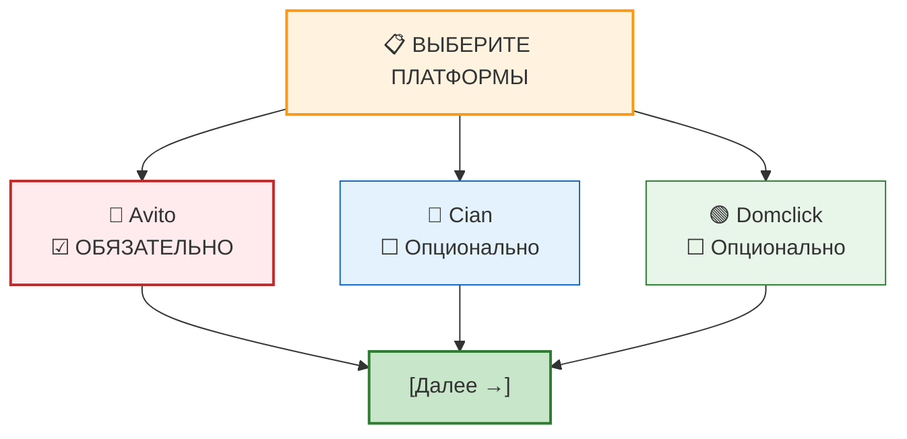
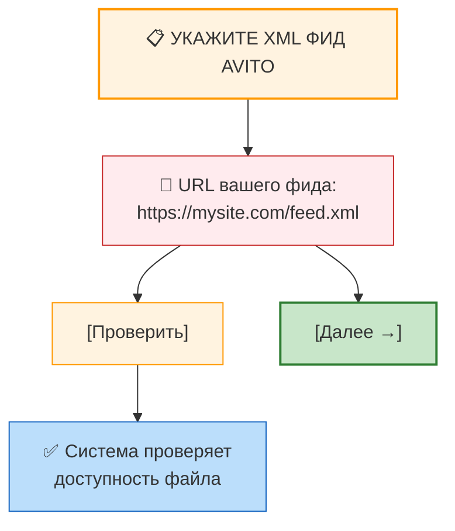
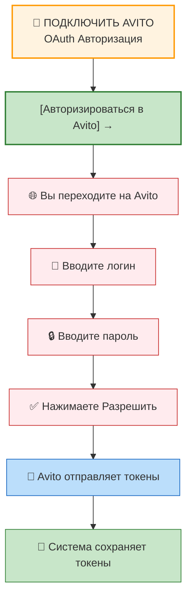
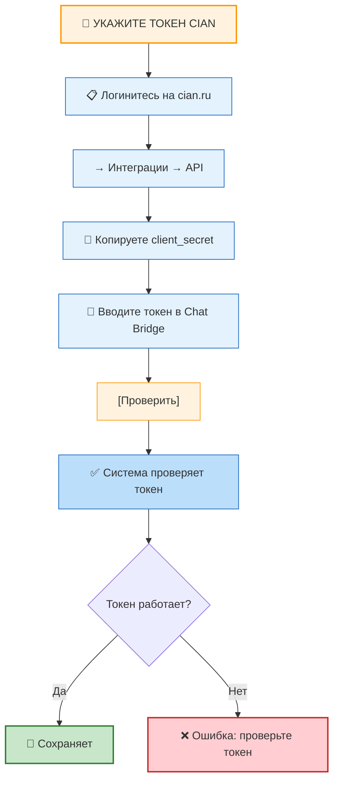
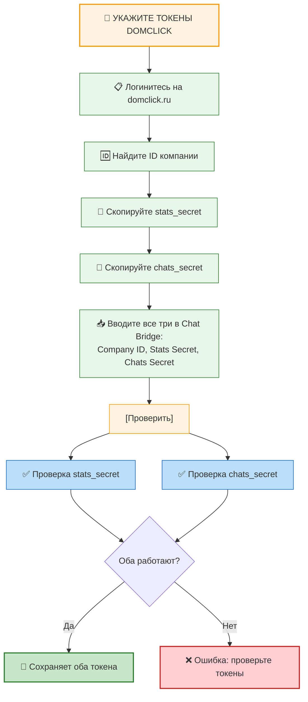
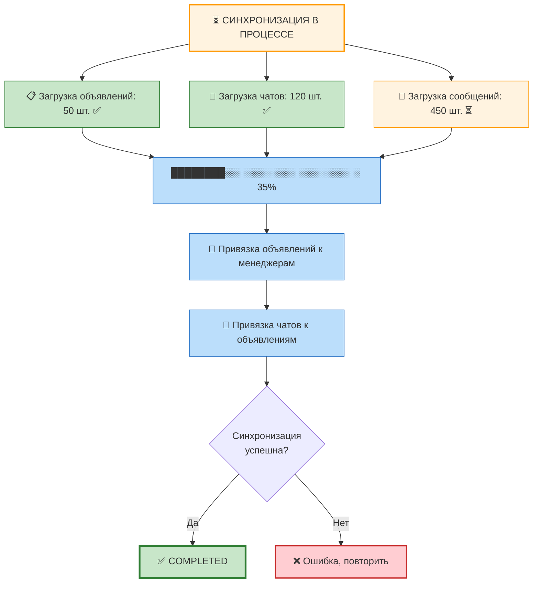
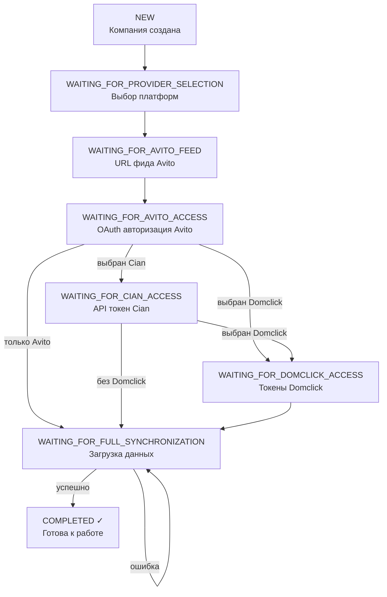

Этот документ описывает все статусы в системе: статусы компании, чатов и сообщений.

## Статусы компании

Компания всегда находится в одном из девяти статусов. Каждый статус определяет, что нужно сделать дальше.

### NEW
**Что это:** Компания только что создана, нужна первоначальная настройка

**Когда наступает:** Сразу после создания компании

**Что нужно сделать:** Выбрать платформы для интеграции

**Переход:** → WAITING_FOR_PROVIDER_SELECTION

**Длится:** Несколько минут (пока пользователь выбирает платформы)

### WAITING_FOR_PROVIDER_SELECTION
**Что это:** Нужно выбрать, какие платформы использовать (Avito обязателен, Cian и Domclick опционально)

**Что показывает пользователю:**


**Переход:** Зависит от выбора:
- Если выбран только Avito → WAITING_FOR_AVITO_FEED
- Если выбран Avito + Cian → WAITING_FOR_AVITO_FEED
- Если выбран Avito + Domclick → WAITING_FOR_AVITO_FEED
- Если выбраны все три → WAITING_FOR_AVITO_FEED

**Длится:** Зависит от пользователя (может быть минута или неделю)

### WAITING_FOR_AVITO_FEED
**Что это:** Нужно указать URL XML фида со своими объявлениями на Avito

**Что показывает пользователю:**


**Что происходит в системе:**
- Система проверяет, доступен ли файл по URL
- Проверяет, что это валидный XML
- Сохраняет URL

**Переход:** → WAITING_FOR_AVITO_ACCESS

**Длится:** Пока пользователь не введёт корректный URL

### WAITING_FOR_AVITO_ACCESS
**Что это:** Нужна OAuth авторизация в Avito (как авторизация через Facebook)

**Что показывает пользователю:**


**Что происходит:**
1. Пользователь нажимает кнопку
2. Переходит на сайт Avito
3. Вводит логин/пароль
4. Нажимает "Разрешить доступ"
5. Avito отправляет код в Chat Bridge
6. Система получает токены

**Переход:** Зависит от выбранных платформ:
- Если выбран Cian → WAITING_FOR_CIAN_ACCESS
- Если выбран Domclick → WAITING_FOR_DOMCLICK_ACCESS
- Если только Avito → WAITING_FOR_FULL_SYNCHRONIZATION

**Длится:** Несколько минут (время авторизации)

### WAITING_FOR_CIAN_ACCESS (если выбран Cian)
**Что это:** Нужно ввести API токен для Cian

**Что показывает:**


**Что происходит:**
- Система проверяет токен (делает тестовый запрос)
- Если работает → сохраняет

**Переход:** Зависит от выбранных платформ:
- Если выбран Domclick → WAITING_FOR_DOMCLICK_ACCESS
- Если только Avito + Cian → WAITING_FOR_FULL_SYNCHRONIZATION

**Длится:** Пока пользователь не введёт корректный токен

### WAITING_FOR_DOMCLICK_ACCESS (если выбран Domclick)
**Что это:** Нужно ввести два API токена для Domclick (stats и chats)

**Что показывает:**


**Что происходит:**
- Система проверяет оба токена
- Если работают → сохраняет

**Переход:** → WAITING_FOR_FULL_SYNCHRONIZATION

**Длится:** Пока пользователь не введёт корректные токены

### WAITING_FOR_FULL_SYNCHRONIZATION
**Что это:** Система загружает все данные (объявления, чаты, сообщения)

**Что показывает пользователю:**


**Что происходит в системе:**
1. Загружаются объявления из XML (Avito)
2. Объявления привязываются к менеджерам
3. Загружаются чаты из всех платформ
4. Для каждого чата загружается история сообщений
5. Всё сохраняется в базе данных

**Переход:** → COMPLETED (если успешно) или остаётся в этом статусе (если ошибка)

**Длится:** 10-60 минут (зависит от объёма данных)

**Если произошла ошибка:**
- Компания остаётся в WAITING_FOR_FULL_SYNCHRONIZATION
- Пользователь может попросить повторную синхронизацию
- Система попытается ещё раз

### COMPLETED
**Что это:** Компания готова к работе, все данные синхронизированы

**Что означает:**
- ✅ Все объявления загружены
- ✅ Все чаты загружены
- ✅ Все сообщения загружены
- ✅ Токены работают и обновляются автоматически (для Avito)
- ✅ Менеджеры могут работать

**Что показывает:**
```
┌──────────────────────────────────────┐
│ ✓ Компания готова к работе!         │
├──────────────────────────────────────┤
│ Объявлений: 50 шт.                  │
│ Чатов: 120 шт.                      │
│ Менеджеров: 3 шт.                   │
│                                      │
│    [Перейти в компанию]            │
└──────────────────────────────────────┘
```

**Как остаться в этом статусе:**
- Система автоматически обновляет токены (Avito)
- Система автоматически синхронизирует новые чаты и сообщения
- Пользователь может:
  - Добавлять новых менеджеров
  - Менять платформы
  - Запрашивать полную повторную синхронизацию

## Диаграмма переходов статусов



## Статусы сообщений

Каждое сообщение имеет свой статус доставки.

### PENDING ⏳
**Что это:** Сообщение в процессе отправки

**Когда:** Пользователь только что нажал "Отправить"

### SENT ✓
**Что это:** Сообщение отправлено на платформу (Avito/Cian/Domclick)

**Когда:** Система успешно передала сообщение платформе

### DELIVERED ✓✓
**Что это:** Сообщение доставлено клиенту (клиент получил уведомление)

**Когда:** Платформа подтвердила доставку

**Ограничение:** Не все платформы поддерживают этот статус

### READ ✓✓✓
**Что это:** Клиент прочитал сообщение

**Когда:** Клиент открыл чат и прочитал сообщение

**Ограничение:** Не все платформы поддерживают этот статус

## Статусы чатов

### АКТИВНЫЙ 🟢
**Что это:** Чат с активной перепиской

**Характеристики:**
- Есть новые сообщения
- Может быть непрочитанные сообщения
- Менеджер должен ответить

### НЕАКТИВНЫЙ ⚪
**Что это:** Чат без новых сообщений

**Характеристики:**
- Давно нет переписки
- История сохранена
- Может быть заархивирован

### АРХИВНЫЙ 🔒
**Что это:** Чат закрыт, но информация сохранена

**Характеристики:**
- История доступна
- Не показывается в основной ленте
- Можно восстановить

## Примеры жизненного цикла компании

### Пример 1: Быстрая настройка (1 день)

```mermaid
timeline
    title Пример 1: Быстрая настройка (1 день)
    10:00 : Иван создаёт компанию "Иванов и партнёры"
          : Статус: NEW → WAITING_FOR_PROVIDER_SELECTION
    10:05 : Выбирает платформы: Avito + Cian
          : Статус: WAITING_FOR_AVITO_FEED
    10:10 : Вводит URL фида
          : Система проверяет URL: OK
          : Статус: WAITING_FOR_AVITO_ACCESS
    10:15 : Авторизуется в Avito через OAuth
          : Avito отправляет токены
          : Статус: WAITING_FOR_CIAN_ACCESS
    10:20 : Вводит токен Cian
          : Система проверяет: OK
          : Статус: WAITING_FOR_FULL_SYNCHRONIZATION
    10:25-10:45 : Синхронизация данных
               : Загружены 50 объявлений
               : Загружены 120 чатов
               : Загружены 450 сообщений
               : Статус: COMPLETED ✓
    10:45 : Компания готова к работе
          : Иван приглашает 3 менеджеров по ссылкам
          : Менеджеры регистрируются и начинают работать
```

### Пример 2: Длительная настройка (1 неделя)

```mermaid
timeline
    title Пример 2: Длительная настройка (1 неделя)
    Пн, 10:00 : Иван создаёт компанию
              : Статус: NEW
    Пн, 10:05 : Выбирает платформы
              : Статус: WAITING_FOR_PROVIDER_SELECTION
    Вт, 14:00 : Иван вводит URL фида (был занят)
              : Статус: WAITING_FOR_AVITO_ACCESS
    Ср, 09:00 : Авторизуется в Avito
              : Статус: WAITING_FOR_CIAN_ACCESS
    Чт, 11:00 : Вводит токен Cian
              : Статус: WAITING_FOR_FULL_SYNCHRONIZATION
    Чт, 11:30 : Синхронизация завершена
              : Статус: COMPLETED ✓
    Пт, 10:00 : Все менеджеры добавлены и работают
```
