Этот документ объясняет, как система подключается к трём основным платформам: Avito, Cian и Domclick. Приведены пошаговые инструкции для project manager и бизнес-аналитика.

## Общие принципы интеграций

### Что такое интеграция

**Интеграция** = способ, которым две системы общаются друг с другом

**Пример:**
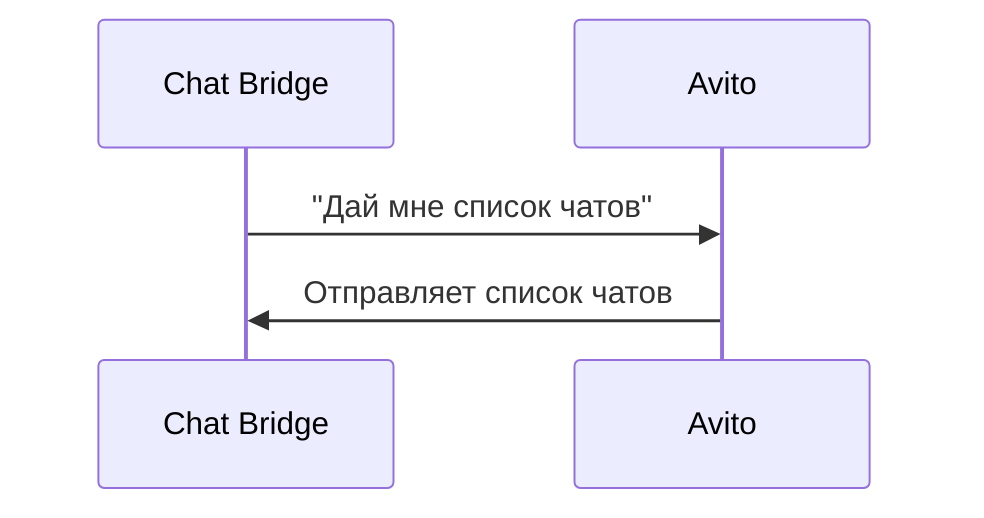

### Токены доступа

Для того чтобы Chat Bridge мог получать данные из платформы, нужен **токен доступа** (API key) — это пропуск, который даёт разрешение:

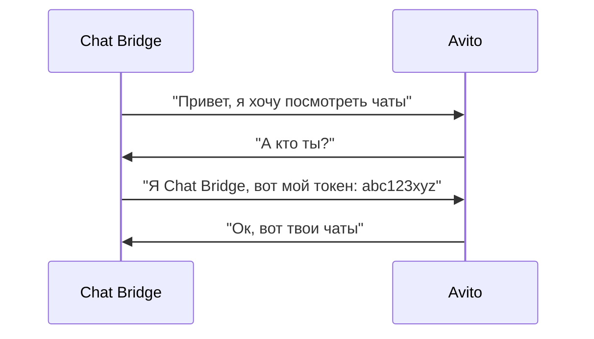

### Где хранятся токены

Все токены хранятся в **зашифрованном виде** в базе данных Chat Bridge:
- Даже администраторы системы не могут увидеть реальный токен
- Токены используются только для запросов к платформам
- Если кто-то украдёт базу данных, токены всё равно будут зашифрованы

## 1. Avito

### Обзор интеграции

**Статус:** ✅ ОСНОВНАЯ ПЛАТФОРМА

**Что синхронизируется:**
- Объявления (из XML фида)
- Чаты (список, история)
- Сообщения (текст, фото, файлы)

**Как часто обновляется:**
- Объявления: один раз при первой настройке, потом по запросу
- Чаты: каждые 15-30 минут автоматически
- Сообщения: каждые 15-30 минут для каждого чата

### Что нужно для подключения

Для подключения Avito нужны **два компонента**:

#### 1. OAuth авторизация

**Что это:** Способ авторизации (похож на "Войти через Facebook" или "Войти через Google")

**Как работает:**
1. Риэлтор нажимает "Подключить Avito"
2. Переводится на сайт Avito
3. Вводит логин и пароль от своего аккаунта на Avito
4. Avito спрашивает: "Разрешить Chat Bridge доступ к вашему аккаунту?"
5. Риэлтор нажимает "Разрешить"
6. Avito отправляет Chat Bridge **access_token** и **refresh_token**

**Что содержит токен:**
- **access_token** — используется для запросов к API Avito (действует ~1 год)
- **refresh_token** — используется для обновления access_token (действует ~2 года)

**Преимущество:** Никогда не нужно вводить пароль от Avito в Chat Bridge

#### 2. XML фид со своими объявлениями

**Что это:** XML файл, в котором риэлтор размещает информацию о своих объектах

**Формат:**
```xml
<?xml version="1.0" encoding="UTF-8"?>
<ads>
  <ad>
    <feed_id>123</feed_id>
    <address>г. Москва, ул. Пушкина, 10, кв. 5</address>
    <price>50000</price>
    <square>65.5</square>
    <rooms>2</rooms>
    <phone>+7 999 111-22-33</phone>
    ...
  </ad>
  ...
</ads>
```

**Где получить:**
- Если нет сайта: Avito сам может сгенерировать фид
- Если есть свой сайт: нужно самому подготовить XML с объявлениями

### Пошаговое подключение Avito

#### Шаг 1: Выбор платформ

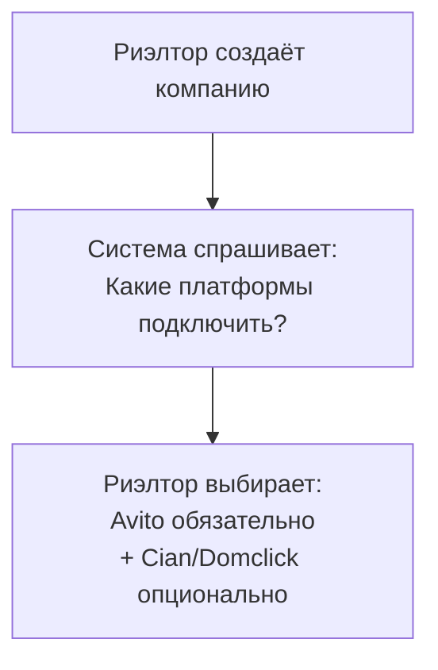

#### Шаг 2: Ввод XML фида

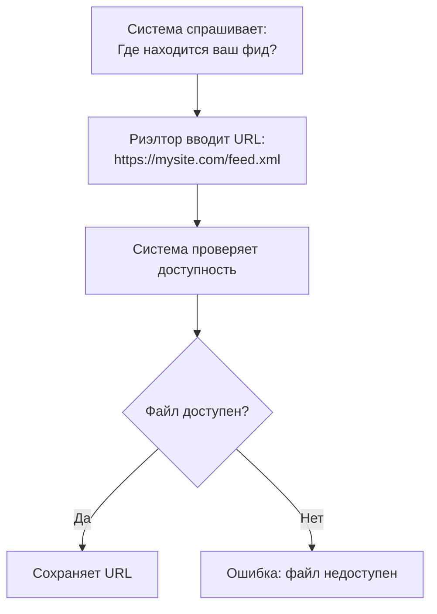

#### Шаг 3: OAuth авторизация

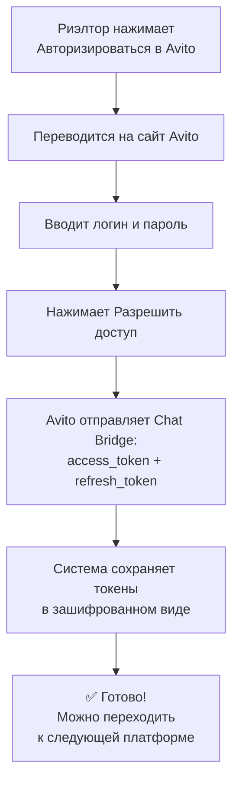

### Автоматическое обновление токенов

**Проблема:** Токены имеют срок действия. Если не обновить, они перестанут работать.

**Решение:** Chat Bridge **автоматически** обновляет токены:

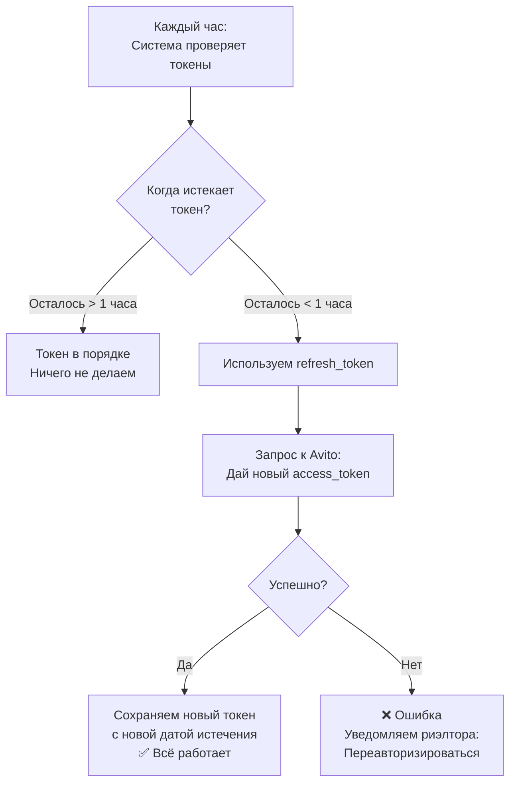

**Если обновление не удалось:**
- Токен помечается как "недоступный"
- Система уведомляет владельца: "Нужно переавторизироваться в Avito"
- Риэлтор повторяет Шаг 3 (OAuth авторизация)

### Процесс синхронизации объявлений

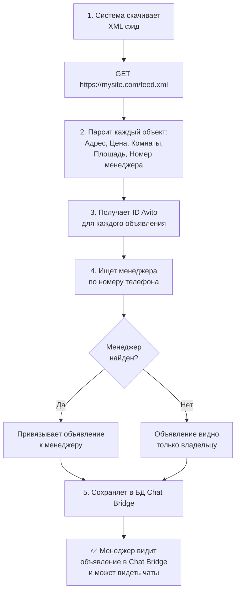

### Процесс синхронизации чатов

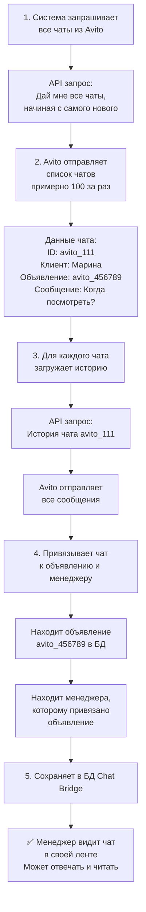

### Проблемы и их решение

| Проблема | Что происходит | Решение |
|----------|----------------|---------|
| Токен не работает | Система не может получить чаты | Переавторизироваться в Avito |
| XML фид недоступен | Объявления не загружаются | Проверить URL фида, убедиться что файл онлайн |
| Объявления не привязаны | Менеджер не видит объявления | Проверить номер телефона в XML |
| Чаты не загружаются | Менеджер видит пустой список | Подождать (синхронизация работает в фоне) |

## 2. Cian

### Обзор интеграции

**Статус:** ✅ ДОПОЛНИТЕЛЬНАЯ ПЛАТФОРМА (опционально)

**Что синхронизируется:**
- Чаты (список, история)
- Сообщения (текст, фото, файлы)

**Как часто обновляется:**
- Чаты: каждые 15-30 минут автоматически

**Ограничение:** Объявления НЕ синхронизируются (в отличие от Avito)

### Что нужно для подключения

#### 1. API токен (client_secret)

**Что это:** Специальный ключ, который даёт разрешение Chat Bridge доступ к API Cian

**Где получить:**
1. Риэлтор логинится на сайт Cian
2. Переходит в "Личный кабинет" → "Интеграции" → "API"
3. Нажимает "Создать новый токен"
4. Копирует токен (выглядит примерно как: `a1b2c3d4e5f6g7h8i9j0k1l2m3n4o5p6`)
5. Никому не показывает (это как пароль)

**Преимущество:** Нет нужно в OAuth авторизации, просто копируем токен

**Недостаток:** Если токен украдут, нужно генерировать новый

### Пошаговое подключение Cian

#### Шаг 1: Получение токена

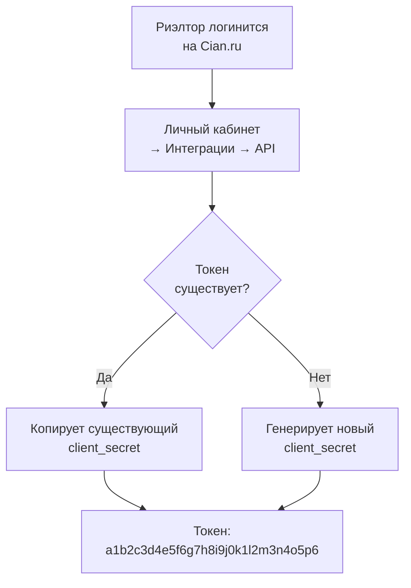

#### Шаг 2: Ввод токена в Chat Bridge

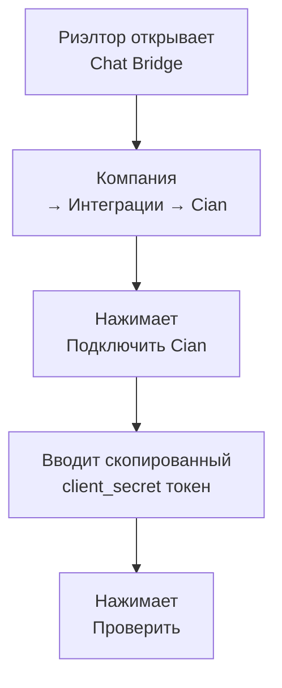

#### Шаг 3: Валидация токена

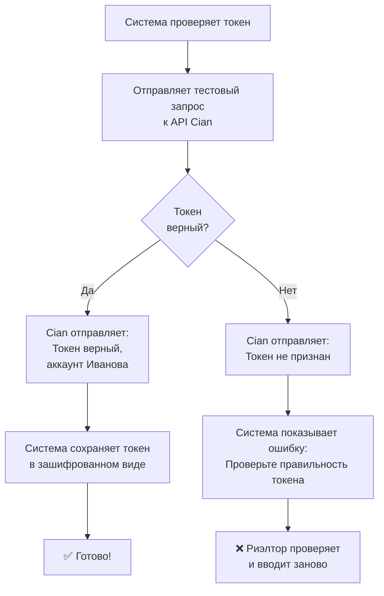

### Синхронизация чатов из Cian

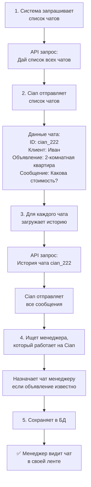

### Обновление токена Cian

**Когда нужно:**
- Токен истёк (если установлена дата истечения)
- Токен потерял силу (Cian их может отзывать)
- Риэлтор решил изменить токен

**Как обновить:**
1. Риэлтор генерирует новый токен на сайте Cian (или берёт существующий)
2. Вводит новый токен в Chat Bridge
3. Система проверяет новый токен
4. Если верный → заменяет старый на новый

## 3. Domclick

### Обзор интеграции

**Статус:** ✅ ДОПОЛНИТЕЛЬНАЯ ПЛАТФОРМА (опционально)

**Что синхронизируется:**
- Чаты (список, история)
- Сообщения (текст, фото, файлы)

**Как часто обновляется:**
- Чаты: каждые 15-30 минут автоматически

**Особенность:** Требует ДВА отдельных токена (для статистики и для чатов)

### Что нужно для подключения

#### 1. ID компании в Domclick

**Что это:** Уникальный ID вашей компании в системе Domclick

**Где найти:**
1. Риэлтор логинится на Domclick.ru
2. Переходит в "Мои компании"
3. Выбирает нужную компанию
4. В URL видит ID (примерно: `/company/12345`)
5. ID = `12345`

#### 2. Два API токена

**Что это:** Domclick требует два отдельных токена:
- **stats_secret** — для доступа к статистике
- **chats_secret** — для доступа к чатам

**Где получить:**
1. Риэлтор логинится на Domclick.ru
2. Переходит в "Интеграции" → "API"
3. Генерирует оба токена
4. Копирует их куда-нибудь в безопасное место

**Почему два токена:**
- stats_secret — для получения аналитики (каких клиентов сколько кликнули)
- chats_secret — для получения чатов и сообщений
- Это сделано для безопасности (если украдут один, другой всё ещё работает)

### Пошаговое подключение Domclick

#### Шаг 1: Подготовка в личном кабинете Domclick

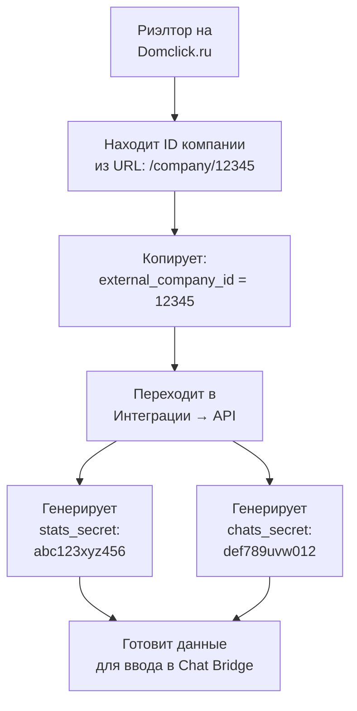

#### Шаг 2: Ввод данных в Chat Bridge

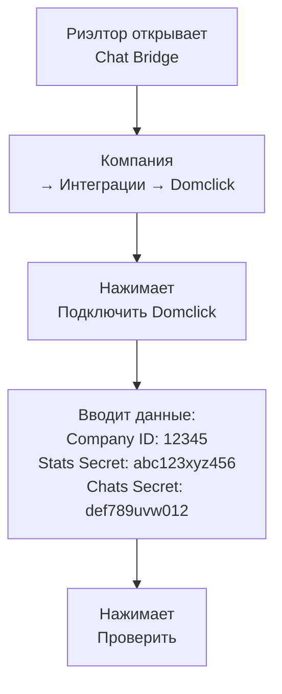

#### Шаг 3: Валидация обоих токенов

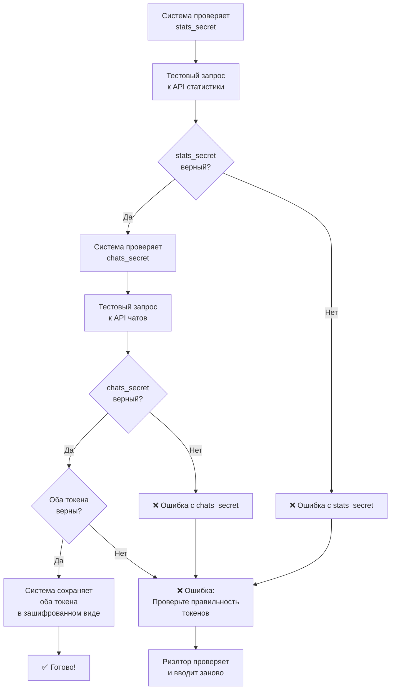

### Синхронизация чатов из Domclick

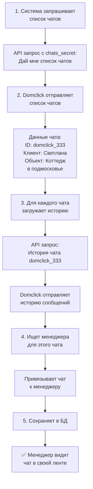

## Сравнение платформ

| Параметр | Avito | Cian | Domclick |
|----------|-------|------|----------|
| **Обязательна** | ✅ Да | ❌ Опционально | ❌ Опционально |
| **Объявления** | ✅ Синхронизируются | ❌ Нет | ❌ Нет |
| **Чаты** | ✅ Да | ✅ Да | ✅ Да |
| **Тип авторизации** | OAuth | Токен | Два токена |
| **Авто-обновление токена** | ✅ Да | ❌ Нет | ❌ Нет |
| **Обновлять вручную** | ❌ Нет | ✅ Иногда | ✅ Иногда |
| **Частота синхронизации** | 15-30 мин | 15-30 мин | 15-30 мин |

## Общие проблемы и решения

### Проблема 1: Токен не работает

**Что происходит:** Система не может получить данные с платформы

**Симптомы:**
- Чаты не обновляются
- В логах ошибка: "401 Unauthorized"
- Компания в статусе "WAITING_FOR_SYNCHRONIZATION"

**Причины:**
- Токен истёк
- Токен был отозван на сайте платформы
- Токен был скопирован неправильно

**Решение:**
1. Зайти на сайт платформы (Avito/Cian/Domclick)
2. Проверить, виден ли токен
3. Если уже не видно → генерировать новый
4. Обновить токен в Chat Bridge

### Проблема 2: OAuth авторизация не работает (Avito)

**Что происходит:** Риэлтор нажимает "Авторизироваться" и ничего не происходит

**Симптомы:**
- Белый экран
- Ошибка "Страница не найдена"
- Редирект не работает

**Решение:**
1. Проверить интернет-соединение
2. Попробовать другой браузер
3. Очистить кеш браузера
4. Попробовать приватное окно (Incognito mode)
5. Обратиться в поддержку

### Проблема 3: Объявления не синхронизируются (Avito)

**Что происходит:** Менеджер не видит объявления в Chat Bridge

**Причины:**
- XML фид имеет неправильный формат
- URL фида недоступен
- Номера телефонов в XML неправильные
- Менеджер ещё не добавлен в компанию

**Решение:**
1. Проверить XML фид (открыть в браузере, убедиться что скачивается)
2. Проверить, что телефоны в XML совпадают с телефонами менеджеров в Chat Bridge
3. Попросить полную повторную синхронизацию
4. Проверить, что менеджер добавлен в компанию

### Проблема 4: Платформа перестала отправлять чаты

**Что происходит:** Раньше чаты были, потом они перестали обновляться

**Возможные причины:**
- Токен истёк или был отозван
- Компания/объявления удалены на платформе
- Произошла ошибка на сервере платформы

**Решение:**
1. Проверить, работает ли токен (попробовать логиниться в аккаунт платформы)
2. Обновить токен
3. Поставить на очередь полную повторную синхронизацию
4. Проверить, не удалены ли объявления на платформе

## Статус синхронизации

Для каждой платформы в компании есть статус синхронизации:

**ACTIVE** ✅
- Токены работают
- Данные обновляются автоматически
- Всё в порядке

**PENDING** ⏳
- Подключение в процессе
- Ждёт ввода токена или фида
- Ничего не синхронизируется

**ERROR** ❌
- Произошла ошибка
- Токен не работает
- Нужно вмешательство пользователя

**DISABLED** 🚫
- Платформа отключена пользователем
- Данные не синхронизируются
- Можно включить обратно в любое время
