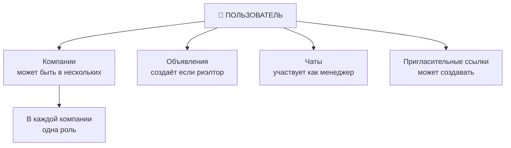
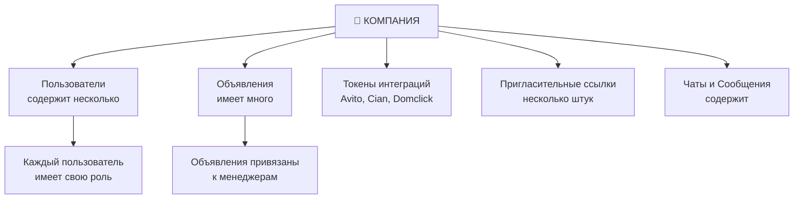
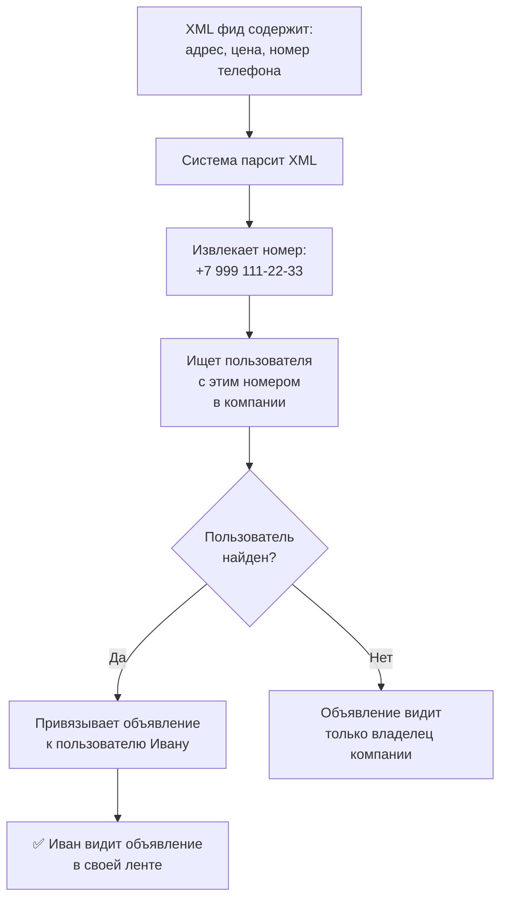
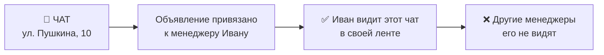
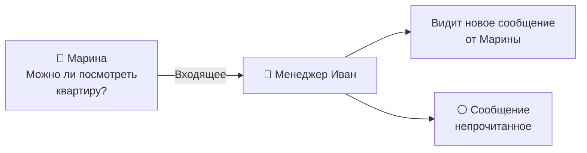
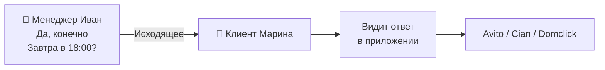
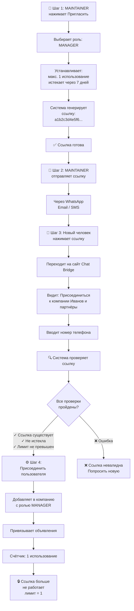
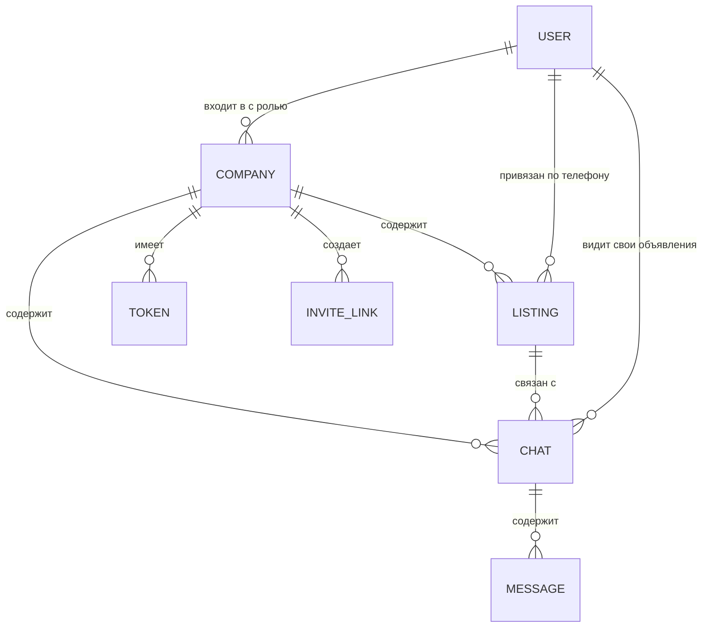
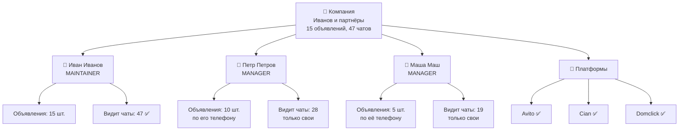
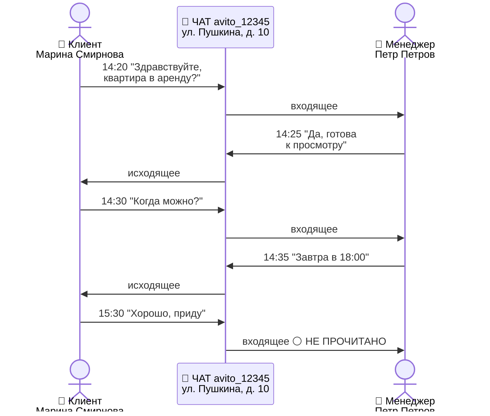

Этот документ объясняет основные типы данных в системе: пользователи, компании, объявления, чаты и сообщения.

## 1. Пользователь

### Что это

**Пользователь** = человек, который работает в системе

### Какая информация хранится

| Информация | Пример | Обязательно |
|-----------|--------|-----------|
| ID | user123 | Да |
| Имя | Иван | Нет |
| Фамилия | Иванов | Нет |
| Номер телефона | +7 999 123-45-67 | Да |
| Фото профиля | URL на фото | Нет |
| Дата регистрации | 2025-01-10 | Да |
| Тип последнего входа | Телефон или Telegram | Да |

### Связи с другими сущностями

### Роли пользователя в компании

Пользователь может иметь одну из трёх ролей в каждой компании:
- **MAINTAINER** — владелец/администратор
- **RESPONSIBLE** — ответственный
- **MANAGER** — менеджер

Более подробно в документе [Роли и права доступа](./05-roles-and-permissions.md)

## 2. Компания

### Что это

**Компания** = агентство недвижимости, индивидуальный риэлтор или call-центр

### Какая информация хранится

| Информация | Пример | Обязательно |
|-----------|--------|-----------|
| ID | company123 | Да |
| Название | Иванов и партнёры | Да |
| Юридический адрес | г. Москва, ул. Пушкина, 10 | Нет |
| ИНН | 7701234567 | Нет |
| ОГРН | 102700009000 | Нет |
| Банк | СбербанкBusiness | Нет |
| Расчётный счёт | 40702810000000000000 | Нет |
| Статус | COMPLETED | Да |
| Использует Avito | Да/Нет | Да |
| Использует Cian | Да/Нет | Да |
| Использует Domclick | Да/Нет | Да |
| Дата создания | 2025-01-10 | Да |

### Статусы компании

Компания всегда в одном из статусов:
- **NEW** — только что создана
- **WAITING_FOR_PROVIDER_SELECTION** — нужно выбрать платформы
- **WAITING_FOR_AVITO_FEED** — нужно указать XML фид
- **WAITING_FOR_AVITO_ACCESS** — нужна OAuth авторизация в Avito
- **WAITING_FOR_CIAN_ACCESS** — нужен токен Cian (если выбран)
- **WAITING_FOR_DOMCLICK_ACCESS** — нужны токены Domclick (если выбран)
- **WAITING_FOR_FULL_SYNCHRONIZATION** — идёт синхронизация данных
- **COMPLETED** — готова к работе

Подробнее: [Статусы](./06-statuses.md)

### Связи с другими сущностями

## 3. Объявление

### Что это

**Объявление** = конкретное предложение недвижимости (квартира, дом, комната и т.д.)

### Какая информация хранится

| Информация | Пример | Где берётся |
|-----------|--------|-----------|
| ID | ad123 | Генерируется системой |
| Адрес | г. Москва, ул. Пушкина, д. 10, кв. 5 | XML фид Avito |
| Описание | 2-комнатная квартира, свежий ремонт | XML фид |
| Цена | 50000 рублей | XML фид |
| Количество комнат | 2 | XML фид |
| Площадь | 65.5 кв.м | XML фид |
| Номер телефона менеджера | +7 999 111-22-33 | XML фид |
| Фотография | URL на главное фото | XML фид |
| Координаты (GPS) | 55.7558, 37.6173 | XML фид или сама система |
| Этаж | 3 | XML фид |
| Всего этажей | 5 | XML фид |
| ID на Avito | avito_456789 | API Avito |
| ID на Cian | cian_555666 | API Cian (если подключен) |
| ID на Domclick | domclick_777888 | API Domclick (если подключен) |

### Привязка к менеджерам

Объявление привязано к менеджеру через **номер телефона**:

## 4. Чат

### Что это

**Чат** = переписка с одним клиентом по одному объявлению

### Какая информация хранится

| Информация | Пример | Описание |
|-----------|--------|---------|
| ID | chat123 | Уникальный ID в Chat Bridge |
| Внешний ID | avito_12345 | ID на исходной платформе |
| Имя клиента | Марина Смирнова | Как клиент представился |
| Номер телефона клиента | +7 999 555-66-77 | Если известен |
| Объявление | ad123 | К какому объявлению обсуждение |
| Платформа | Avito/Cian/Domclick | Откуда этот чат |
| Первое сообщение | 2025-01-12 14:20 | Когда начался чат |
| Последнее сообщение | 2025-01-14 15:30 | Когда последний раз писали |
| Количество сообщений | 5 | Сколько всего в чате |
| Непрочитанные | 2 | Сколько ещё не прочитаны |

### Привязка к менеджеру

Чат видит менеджер, к которому привязано объявление:

### Типы сообщений в чате

В каждом чате могут быть разные типы сообщений:
- **Text** — обычное текстовое сообщение
- **Image** — фотография
- **File** — документ или файл
- **Link** — ссылка
- **Location** — геолокация (адрес на карте)
- **System** — системное сообщение (например, "Чат был переведён")
- **Call** — информация о звонке

## 5. Сообщение

### Что это

**Сообщение** = одно отдельное сообщение в чате

### Какая информация хранится

| Информация | Пример | Описание |
|-----------|--------|---------|
| ID | msg123 | Уникальный ID |
| ID в системе | avito_msg_456 | ID на исходной платформе |
| Чат | chat123 | К какому чату относится |
| Текст | "Можно ли посмотреть в 18:00?" | Содержание сообщения |
| Тип | Text, Image, File и т.д. | Какой тип сообщения |
| Направление | Входящее/Исходящее | Кто написал |
| Автор | Марина / Иван | Кто именно написал |
| Дата отправки | 2025-01-14 15:30 | Когда написано |
| Дата прочтения | 2025-01-14 15:35 | Когда прочитано |
| Статус доставки | Отправлено/Доставлено/Прочитано | Статус доставки |

### Направление сообщения

Каждое сообщение либо **входящее**, либо **исходящее**:

**Входящее (In)** = клиент написал менеджеру:

**Исходящее (Out)** = менеджер ответил клиенту:

### Статусы сообщения

- **PENDING** ⏳ — сообщение в процессе отправки
- **SENT** ✓ — отправлено на платформу
- **DELIVERED** ✓✓ — доставлено клиенту (клиент получил уведомление)
- **READ** ✓✓✓ — клиент прочитал сообщение

**Не все платформы поддерживают все статусы** — некоторые не отправляют информацию о прочтении.

## 6. Пригласительная ссылка

### Что это

**Пригласительная ссылка** = временный "билет" для присоединения к компании

### Какая информация хранится

| Информация | Пример | Описание |
|-----------|--------|---------|
| ID | link123 | Уникальный ID ссылки |
| Токен | a1b2c3d4e5f6... | 32 символа, которые шлют новому пользователю |
| Компания | company123 | К какой компании привязана |
| Роль при входе | MANAGER | Какую роль получит новый пользователь |
| Макс. использований | 5 | Сколько раз её можно использовать (или бесконечно) |
| Текущее использование | 2 | Сколько раз уже использовали |
| Дата истечения | 2025-02-10 | Когда ссылка перестанет работать (или никогда) |
| Кто создал | Иван Иванов | Какой MAINTAINER создал ссылку |
| Дата создания | 2025-01-10 | Когда создана |

### Как работает ссылка

## 7. Токены интеграций

### Что это

**Токен интеграции** = пароль для доступа к API платформ (Avito, Cian, Domclick)

### Avito Token

| Информация | Описание |
|-----------|---------|
| Access Token | Используется для запросов к API Avito (действует ~1 год) |
| Refresh Token | Используется для получения нового access token |
| Дата истечения | Когда токен перестанет работать |
| Статус доступности | Работает ли токен или нет |

**Автоматизм:** Система сама обновляет токен за час до истечения

### Cian Token

| Информация | Описание |
|-----------|---------|
| Client Secret | API токен для доступа к API Cian |
| Статус активности | Активен или отключен |

**Обновление:** Нужно обновлять вручную (генерировать новый на сайте Cian)

### Domclick Token

| Информация | Описание |
|-----------|---------|
| Stats Secret | Токен для доступа к статистике |
| Chats Secret | Токен для доступа к чатам |
| Company ID | ID компании в системе Domclick |
| Статус активности | Активны или отключены |

**Обновление:** Нужно обновлять вручную (генерировать на сайте Domclick)

## Связи между сущностями (диаграмма)

## Примеры реальных данных

### Пример 1: Компания с менеджерами

### Пример 2: Чат с историей

**Информация о чате:**
- Клиент: Марина Смирнова (+7 999 555-66-77)
- Объявление: Квартира на ул. Пушкина, д. 10
- Менеджер: Петр Петров
- Платформа: Avito
- Всего сообщений: 5
- Непрочитанных: 1
